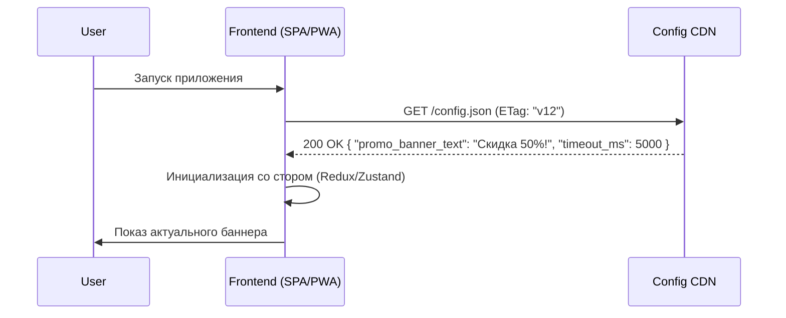

# Remote Configuration (Удаленная конфигурация)

## Суть концепции
Remote Config — это механизм доставки конфигурационных параметров в клиентское приложение без необходимости выпускать новый релиз (деплоить код или просить пользователя обновить мобильное приложение).
**Боль:** Изменение любой мелочи (цвета кнопки, текста баннера, лимита пагинации, таймаута запроса) требует прохождения всего CI/CD пайплайна, что занимает от минут (веб) до недель (мобайл/App Store). Удаленная конфигурация позволяет продакт-менеджерам или DevOps инженерам менять поведение приложения "на лету" из удобной админки.

## Как это работает

При старте или периодически фронтенд запрашивает JSON с настройками с сервера (Firebase Remote Config, LaunchDarkly, или самописный сервис) и кладет его в стейт.



## Примеры кода: Избегаем блокировки UI

**Антипаттерн:** Блокировать рендер всего приложения, пока не загрузится Remote Config. Если сервер с конфигом "моргнет" или пользователь едет в туннеле с плохим 3G, он увидит белый экран.

```typescript
// ❌ АНТИПАТТЕРН: Приложение не грузится без конфига
const App = () => {
  const { config, loading } = useFetchConfig();
  
  if (loading) return <Spinner />; // Блокировка!
  return <MainLayout bannerText={config.banner_text} />;
};
```

**Правильное решение:** Использовать локальные фоллбеки (дефолтные значения), отрендерить приложение сразу, а при загрузке конфига — плавно обновить UI (если это безопасно и не вызовет Layout Shift).

```typescript
// ✅ ПРАВИЛЬНО: Дефолтные значения и асинхронное применение
const DEFAULT_CONFIG = {
  promo_banner_enabled: false,
  api_timeout: 3000
};

const RemoteConfigProvider = ({ children }) => {
  const [config, setConfig] = useState(DEFAULT_CONFIG);

  useEffect(() => {
    // Грузим в фоне, не блокируя первый Paint
    fetchRemoteConfig().then((newConfig) => {
      setConfig({ ...DEFAULT_CONFIG, ...newConfig });
    }).catch(console.error);
  }, []);

  return <ConfigContext.Provider value={config}>{children}</ConfigContext.Provider>;
};
```

## Неочевидные нюансы: трейдоффы и границы применимости
- **Синхронизация стейта (Flickering):** Если вы меняете структуру UI через Remote Config после загрузки, интерфейс может "прыгнуть". Решение: сохранять предыдущий скачанный конфиг в `localStorage` и при следующем запуске использовать его как initial state, пока качается новый.
- **Версионирование схемы конфига:** Если бэкенд удалит поле из JSON, а старый фронтенд (который пользователь не обновил) ожидает его наличие и делает `.length`, приложение упадет (Uncaught TypeError). Схема конфига должна быть обратно совместимой, а фронтенд обязан валидировать JSON (например, через Zod).
- **Security:** Remote Config качается на клиент. Не кладите туда секреты, API-ключи, приватные токены и логику начисления бонусов.
