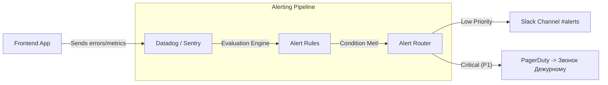

# Alerting (Алертинг и оповещения)

## Что это и какую боль мы решаем?
Алертинг — это система автоматического оповещения инженеров об аномалиях в работе приложения. 
**Боль:** Без алертинга вы узнаете о том, что кнопка "Оплатить" сломалась, из гневных твитов пользователей или от CEO. Сидеть и смотреть в дашборды с графиками 24/7 невозможно. Алертинг автоматизирует процесс: система сама следит за метриками и, если они выходят за пределы нормы, отправляет сообщение в Slack, Telegram или звонит дежурному инженеру (PagerDuty).

## Как это работает

Алерты строятся поверх **метрик** (Metrics) или **логов** (Logs). Вы задаете правило (PromQL, Datadog Monitor), порог срабатывания (Threshold) и окно времени.

## Как писать правила: Ошибки новичков

**Антипаттерн:** Создавать алерты на статические пороги ("Если количество ошибок JS > 100"). Ночью трафика нет, и 100 ошибок — это 100% пользователей. В черную пятницу 100 ошибок — это 0.001%, и алерт будет постоянно спамить, вызывая Alert Fatigue (выгорание от алертов).

**Правильное решение:** Использовать относительные метрики (Error Rate) и Anomaly Detection.

*Пример хорошего правила (на псевдокоде PromQL):*
`rate(frontend_errors_total[5m]) / rate(frontend_requests_total[5m]) > 0.05`
*(Если доля ошибок больше 5% за последние 5 минут — бьем тревогу).*

## Неочевидные нюансы и границы применимости
- **Alert Fatigue (Усталость от алертов):** Если алерт срабатывает, но инженер просто ставит эмодзи :eyes: и ничего не делает — этот алерт мусорный, его нужно удалить. Алерты должны быть actionable (требующими действия).
- **Flapping (Мерцание алертов):** Когда метрика колеблется прямо на границе порога (то 4.9%, то 5.1%), алерт будет постоянно то открываться, то закрываться, сводя дежурного с ума. Решение: использование гистерезиса или параметров `for: 5m` (метрика должна стабильно превышать порог в течение 5 минут).
- **Разделение по критичности:** 
  - **P1 (Critical):** Упал чекаут, белый экран (Звонок ночью).
  - **P2 (High):** Отвалилась некритичная фича, сильно деградировал перфоманс (Сообщение в Slack с тегом @frontend-oncall).
  - **P3 (Low):** Выросли минорные ошибки (Тикет в Jira в бэклог).
