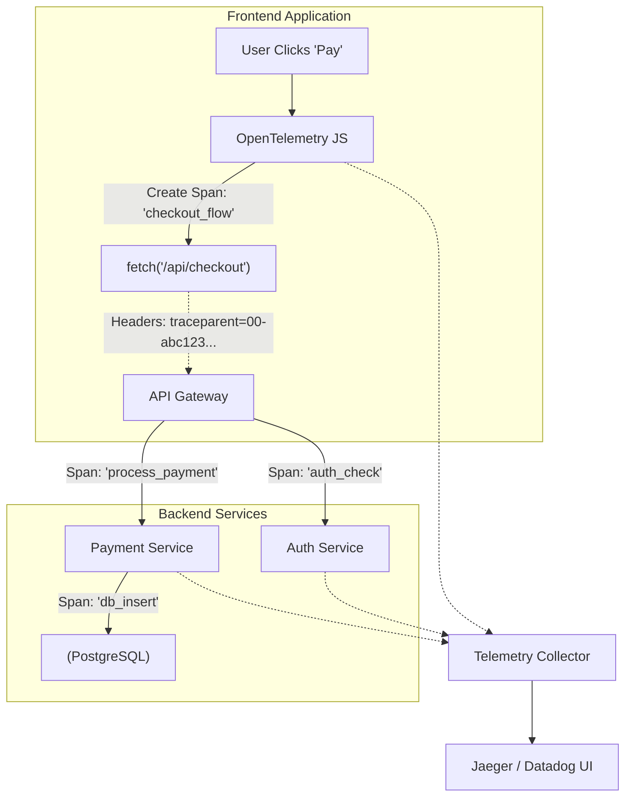

# Distributed Tracing (Распределенная трассировка)

## Суть концепции

В современной микросервисной архитектуре и сложных SPA-приложениях путь пользовательского запроса редко ограничивается одним сервером. Запрос от фронтенда может пройти через API Gateway, сервис авторизации, микросервис заказов и базу данных. **Distributed Tracing (Распределенная трассировка)** — это метод отслеживания такого сложного пути единого бизнес-действия (Trace) от клика в браузере до самого глубокого бэкенда.

Трассировка разбивает этот путь на **Spans (спаны)** — логические единицы работы (например, "отрисовка компонента", "HTTP-запрос", "SQL-запрос"), имеющие начало, конец, контекст и связь с родительским спаном.

## Какую боль мы решаем?

1. **"Где тормозит?"** Пользователь жалуется на медленную загрузку корзины. Фронтенд показывает, что запрос шел 5 секунд. Бэкенд корзины утверждает, что ответил за 100мс. Где потерялись 4.9 секунды? Балансировщик? DNS? Сервис цен, к которому ходит корзина? Трейсинг рисует водопад (waterfall) всего пути.
2. **Анализ зависимостей.** Сложно понять, какие именно микросервисы (и в каком порядке) затрагивает конкретный флоу на фронтенде.
3. **Обвинения между командами (Blame Game).** Фронтендеры винят бэкендеров в таймаутах, бэкендеры винят базу данных. Трейсинг дает объективную, математически точную картину.

## Как это работает на практике

Главный механизм — это проброс идентификаторов (`trace_id` и `span_id`) через HTTP-заголовки. Фронтенд генерирует (или получает от сервера) уникальный `trace_id` и прикрепляет его к каждому запросу (например, в заголовок `traceparent` согласно стандарту W3C Trace Context).



### Примеры кода

**Антипаттерн: Разрозненные идентификаторы логов**
Генерация случайных ID на каждый чих без соблюдения иерархии (Trace -> Span).

```typescript
// Плохо: Нет сквозного контекста, каждый лог сам по себе
async function makePayment() {
  const reqId = uuidv4();
  console.log(`[${reqId}] Starting payment...`);
  
  await fetch('/api/pay', { headers: { 'X-Request-ID': reqId } });
}
```

**Паттерн: Использование стандарта W3C Trace Context (OpenTelemetry)**
Автоматический или ручной проброс контекста, где каждый сетевой вызов является дочерним спаном пользовательского действия.

```typescript
// Хорошо: Интеграция с OpenTelemetry
import { trace, context } from '@opentelemetry/api';

const tracer = trace.getTracer('frontend-app');

async function makePayment() {
  // Создаем Span, который охватывает весь процесс
  await tracer.startActiveSpan('user_checkout', async (span) => {
    try {
      span.setAttribute('payment.method', 'credit_card');
      
      // Fetch автоматически подхватит текущий контекст 
      // и добавит заголовок traceparent, если настроен плагин otlp-fetch
      await fetch('/api/pay', { method: 'POST' });
      
      span.setStatus({ code: SpanStatusCode.OK });
    } catch (e) {
      span.setStatus({ code: SpanStatusCode.ERROR, message: e.message });
      span.recordException(e);
    } finally {
      span.end();
    }
  });
}
```

## Неочевидные нюансы и трейдоффы

1. **Сэмплирование (Sampling) - необходимость.** Собирать 100% трейсов на высоконагруженном проекте — значит тратить на мониторинг больше ресурсов, чем на сам продукт. 
   * **Границы применимости:** Используйте *Tail-based sampling*. Это значит, что решение о том, сохранить трейс или выбросить, принимается не на фронтенде в момент старта (Head-based), а на коллекторе в конце. Сохраняются только ошибки, аномально долгие запросы и, например, 1% успешных.
2. **Clock Skew (Рассинхронизация времени).** Время на телефоне пользователя и на серверах AWS может отличаться. Если не использовать правильные механизмы синхронизации (или относительные тайминги), дочерний спан на сервере может начаться "раньше", чем родительский клик в браузере.
3. **CORS и Заголовки.** Для проброса `traceparent` на другой домен (например, с `app.site.com` на `api.site.com`) необходимо явно разрешить этот заголовок в настройках CORS (`Access-Control-Allow-Headers`). Иначе запросы будут падать.
