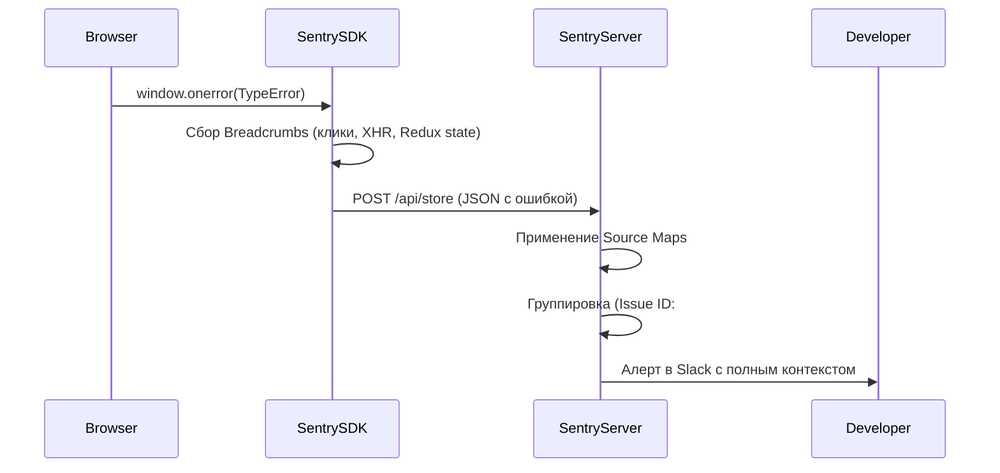

# Error Tracking (Отслеживание ошибок)

## Что это и какую боль мы решаем?
Error Tracking — это автоматический сбор, группировка и анализ необработанных исключений (Uncaught Exceptions) и отклоненных промисов (Unhandled Rejections) в браузере пользователя. Самый популярный инструмент на рынке — **Sentry**.
**Боль:** В браузере нет доступа к консоли разработчика пользователя. Если `TypeError: Cannot read properties of undefined` ломает UI, мы об этом не узнаем. А если узнаем, то не поймем где именно (код минифицирован) и при каких обстоятельствах (какой был стейт, какие действия привели к ошибке).

## Как это работает на практике

Библиотека-агент (Sentry SDK) перехватывает глобальные обработчики (`window.onerror`, `unhandledrejection`), собирает стек-трейс, "хлебные крошки" (breadcrumbs — последние клики и fetch-запросы пользователя) и отправляет на сервер. Там ошибка деобфусцируется с помощью Source Maps и группируется по хэшу стек-трейса.



## Примеры кода: Как правильно ловить ошибки

**Антипаттерн:** Глотание ошибок (Swallowing Errors). Использование пустого `catch` блока, из-за которого трекер никогда не узнает о проблеме.

```typescript
// ❌ АНТИПАТТЕРН: Ошибка "съедена"
try {
  const data = JSON.parse(userProvidedString);
} catch (e) {
  // Ничего не делаем. В Sentry ничего не попадет, а приложение поведет себя непредсказуемо.
}
```

**Правильное решение:** Явная отправка ошибок (Capture Exception) с дополнительным контекстом.

```typescript
// ✅ ПРАВИЛЬНО: Перехват, обогащение контекстом и отправка
import * as Sentry from '@sentry/browser';

try {
  const data = JSON.parse(userProvidedString);
} catch (error) {
  Sentry.withScope((scope) => {
    // Добавляем бизнес-контекст, который поможет в дебаге
    scope.setExtra("raw_input", userProvidedString);
    scope.setTag("feature", "user_profile_import");
    Sentry.captureException(error);
  });
  
  // Фолбэк UI для пользователя
  showToast('Не удалось обработать данные');
}
```

## Внедрение в продакшене: почему прямое подключение не работает

В туториалах Sentry подключают в 3 строчки прямо на фронтенде. В реальных проектах напрямую почти не стучатся — не потому что «взломают Sentry» (DSN — публичный ключ только на запись), а по трем причинам:

1. **AdBlock съедает 15–30% логов.** uBlock Origin, AdGuard и Brave блокируют запросы к `sentry.io`. Вы думаете, что всё идеально, хотя у пятой части пользователей всё сломалось.
2. **Утечка чувствительных данных (PII).** SDK по умолчанию собирает всё: URL (где могут быть `?token=abc`), заголовки (`Authorization: Bearer`), значения полей ввода (пароли, карты). Слить это на сторонний сервис — нарушение GDPR/ФЗ-152.
3. **Выжигание квоты (Quota Burning).** Оплата идет за события. Злоумышленник вытаскивает DSN из бандла и спамит миллион ошибок в минуту — месячный лимит сгорает за часы.

### Подход 1. Туннелирование через бэкенд (Sentry Tunneling) — самый популярный

Фронтенд шлет ошибки не в Sentry, а на свой же сервер, который проксирует их дальше. AdBlock не блокирует запрос на ваш домен, а бэкенд может отсечь спам и проверить авторизацию.

```text
[Фронтенд] ──► (POST /api/sentry-tunnel) ──► [Ваш Бэкенд / Nginx] ──► [Sentry Cloud]
```

```javascript
// next.config.js — во многих фреймворках туннель встроен
module.exports = withSentryConfig(nextConfig, {
  tunnelRoute: "/api/monitoring-tunnel",
});
```

### Подход 2. Sentry Relay (Enterprise-стандарт)

Для строгих контуров (банки, финтех, медицина) поднимают **Sentry Relay** — официальный прокси-сервер внутри вашего K8s/Docker.

```text
[Все клиенты] ──► [Sentry Relay во внутреннем контуре] ──► [Sentry Cloud / On-Premise]
```

Relay маскирует PII *до выхода из контура*, ограничивает rate limit на взбесившиеся сервисы и позволяет мгновенно заблокировать конкретный DSN.

### Подход 3. Обязательная очистка на клиенте (`beforeSend`)

Даже с туннелем на фронтенде фильтруют данные, чтобы ни при каких обстоятельствах не слить токены:

```javascript
Sentry.init({
  dsn: "https://public@sentry.my-company.com/1",
  beforeSend(event, hint) {
    // Срезаем query-параметры (там могут быть токены)
    if (event.request?.url) {
      event.request.url = event.request.url.split('?')[0];
    }
    // Удаляем заголовки авторизации
    if (event.request?.headers) {
      delete event.request.headers['Authorization'];
      delete event.request.headers['Cookie'];
    }
    // Мусор от браузерных расширений — не отправляем
    const error = hint.originalException;
    if (error?.message?.includes('top.GLOBALS')) return null;
    return event;
  },
});
```

**Итог:** DSN из туториала в SPA — потеря трети ошибок, риск слива JWT и спам. Правильная связка — Tunneling/Relay + `beforeSend` + Allowed Origins в панели Sentry.

## Неочевидные нюансы и трейдоффы
- **Source Maps Leak:** Чтобы Sentry показал красивый код, ему нужны Source Maps. Если грузить мапы публично на прод, кто угодно сможет скачать ваши исходники. Решение: не деплоить `.map` файлы на продакшен сервера, а заливать их напрямую в Sentry во время CI/CD пайплайна, а затем удалять.
- **Шум от расширений:** Около 10-20% всех ошибок в Sentry — это мусор от кривых Chrome-экстеншенов (AdBlockers, антивирусы), которые внедряют свой JS на вашу страницу и падают. Необходимо настраивать строгие `ignoreErrors` фильтры.
- **Группировка:** Sentry может плохо сгруппировать ошибку, если в ее тексте есть динамический ID (`User 123 not found` и `User 456 not found` станут разными ишью). Правильно выбрасывать параметризованные ошибки, а ID выносить в `tags` или `extras`.
