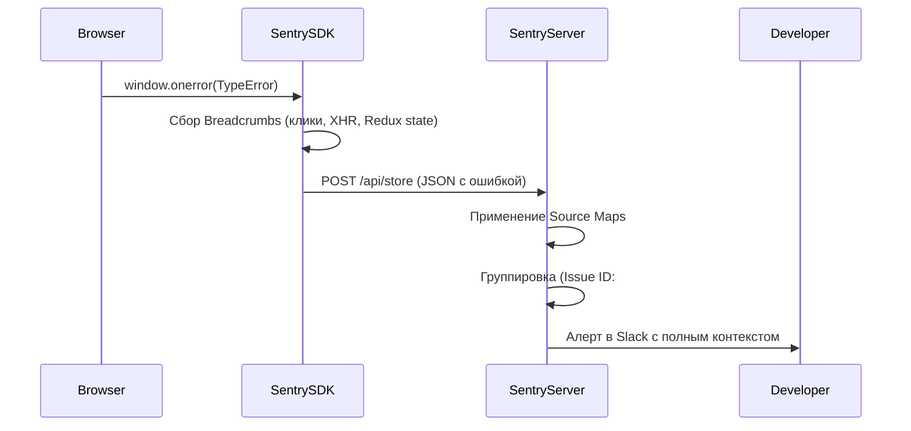

# Error Tracking (Отслеживание ошибок)

## Что это и какую боль мы решаем?
Error Tracking — это автоматический сбор, группировка и анализ необработанных исключений (Uncaught Exceptions) и отклоненных промисов (Unhandled Rejections) в браузере пользователя. Самый популярный инструмент на рынке — **Sentry**.
**Боль:** В браузере нет доступа к консоли разработчика пользователя. Если `TypeError: Cannot read properties of undefined` ломает UI, мы об этом не узнаем. А если узнаем, то не поймем где именно (код минифицирован) и при каких обстоятельствах (какой был стейт, какие действия привели к ошибке).

## Как это работает на практике

Библиотека-агент (Sentry SDK) перехватывает глобальные обработчики (`window.onerror`, `unhandledrejection`), собирает стек-трейс, "хлебные крошки" (breadcrumbs — последние клики и fetch-запросы пользователя) и отправляет на сервер. Там ошибка деобфусцируется с помощью Source Maps и группируется по хэшу стек-трейса.



## Примеры кода: Как правильно ловить ошибки

**Антипаттерн:** Глотание ошибок (Swallowing Errors). Использование пустого `catch` блока, из-за которого трекер никогда не узнает о проблеме.

```typescript
// ❌ АНТИПАТТЕРН: Ошибка "съедена"
try {
  const data = JSON.parse(userProvidedString);
} catch (e) {
  // Ничего не делаем. В Sentry ничего не попадет, а приложение поведет себя непредсказуемо.
}
```

**Правильное решение:** Явная отправка ошибок (Capture Exception) с дополнительным контекстом.

```typescript
// ✅ ПРАВИЛЬНО: Перехват, обогащение контекстом и отправка
import * as Sentry from '@sentry/browser';

try {
  const data = JSON.parse(userProvidedString);
} catch (error) {
  Sentry.withScope((scope) => {
    // Добавляем бизнес-контекст, который поможет в дебаге
    scope.setExtra("raw_input", userProvidedString);
    scope.setTag("feature", "user_profile_import");
    Sentry.captureException(error);
  });
  
  // Фолбэк UI для пользователя
  showToast('Не удалось обработать данные');
}
```

## Неочевидные нюансы и трейдоффы
- **Source Maps Leak:** Чтобы Sentry показал красивый код, ему нужны Source Maps. Если грузить мапы публично на прод, кто угодно сможет скачать ваши исходники. Решение: не деплоить `.map` файлы на продакшен сервера, а заливать их напрямую в Sentry во время CI/CD пайплайна, а затем удалять.
- **Шум от расширений:** Около 10-20% всех ошибок в Sentry — это мусор от кривых Chrome-экстеншенов (AdBlockers, антивирусы), которые внедряют свой JS на вашу страницу и падают. Необходимо настраивать строгие `ignoreErrors` фильтры.
- **Группировка:** Sentry может плохо сгруппировать ошибку, если в ее тексте есть динамический ID (`User 123 not found` и `User 456 not found` станут разными ишью). Правильно выбрасывать параметризованные ошибки, а ID выносить в `tags` или `extras`.
