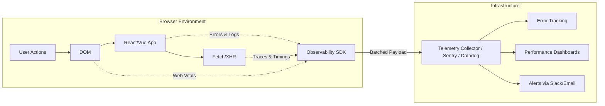

# Frontend Observability (Наблюдаемость фронтенда)

## Суть концепции

**Observability (Наблюдаемость)** — это мера того, насколько хорошо мы можем понять внутреннее состояние системы по её внешним выводам (логам, метрикам и трейсам). 

Исторически Observability применялась к бэкенду. На фронтенде мы привыкли полагаться на "у меня работает", а если что-то падало у клиента — это оставалось тайной, скрытой в консоли браузера пользователя. Frontend Observability решает эту проблему, давая инженерам полную картину происходящего в приложении *на устройствах реальных пользователей*.

Мы не просто ловим ошибки, мы собираем контекст: сеть, DOM-события, производительность рендеринга и последовательность действий, приведших к сбою.

## Какую боль мы решаем?

1. **"Плавающие" баги (Heisenbugs).** Баг, который воспроизводится только на Safari 13, на старом iPhone при слабом 3G соединении. Без Observability найти его причину почти невозможно.
2. **Тихие отказы (Silent Failures).** API изменило формат ответа, парсер на фронте тихо упал, `try/catch` проглотил ошибку, кнопка "Купить" перестала нажиматься. Бизнес теряет деньги, а алертов нет.
3. **Деградация производительности.** Новый релиз замедлил TTI (Time to Interactive) на 2 секунды. Синтетические тесты в Lighthouse на мощных макбуках разработчиков этого не покажут (они меряют лабораторные данные), а RUM (Real User Monitoring) — покажет.

## Три столпа Observability на фронтенде

1. **Logs (Ошибки и логи).** Stack trace, unhandled rejections.
2. **Metrics (Метрики).** Core Web Vitals (LCP, FID, CLS), время загрузки API, бизнес-метрики (конверсии).
3. **Traces (Трейсы).** Путь запроса. Если запрос к API упал с 500, трейс связывает клик пользователя на фронтенде с конкретным упавшим микросервисом на бэкенде.



### Примеры кода

**Антипаттерн: Замалчивание ошибок и `console.error`**
Ошибки остаются только на машине пользователя.

```typescript
// Плохо: Ошибка теряется в браузере клиента
async function fetchUserData() {
  try {
    const res = await api.getUser();
    setUser(res.data);
  } catch (error) {
    console.error("Не удалось загрузить пользователя", error);
    // Пользователь видит бесконечный лоадер
  }
}
```

**Паттерн: Централизованный Error Boundary и логирование с контекстом**
Перехват ошибок на уровне UI и явная отправка в систему мониторинга (например, Sentry) с привязкой тегов.

```typescript
// Хорошо: Инкапсуляция сбора данных
import { captureException, setTag } from '@core/monitoring';

async function fetchUserData(userId: string) {
  try {
    const res = await api.getUser(userId);
    setUser(res.data);
  } catch (error) {
    // Обогащаем ошибку контекстом
    setTag('action', 'fetchUserData');
    setTag('userId', userId);
    captureException(error, { level: 'error' });
    
    showToast('Произошла ошибка, мы уже разбираемся!');
  }
}
```

## Неочевидные нюансы и трейдоффы

1. **Оверхед (Налог на перфоманс).** Сбор метрик, перехват консоли и сети, запись DOM (для Session Replay) требуют CPU и памяти браузера. Сама SDK может весить 30-50kb gzip.
   * **Решение:** Использовать сэмплирование (sampling). Собирать трейсы и Session Replay не со 100% сессий, а, например, с 5% пользователей или только при возникновении `Error`.
2. **Приватность и PII (Personally Identifiable Information).** Фронтенд-логи легко могут зацепить пароли из инпутов, токены, номера карт и личные данные. Это прямое нарушение GDPR.
   * **Ограничения:** Настройте SDK на маскирование (scrubbing) данных. Инпуты типа password должны игнорироваться автоматически. Чувствительные данные лучше вырезать на стороне балансировщика/коллектора до попадания в БД.
3. **Шум (Alert Fatigue).** Треть ошибок фронтенда — это проблемы с расширениями браузера пользователя, обрывы сети (Failed to fetch) и старые кэши.
   * **Решение:** Группировка ошибок по stack trace и настройка игнор-листов. Алертить нужно не на каждую ошибку, а на всплески (spike) конкретного типа ошибок или на падение важных бизнес-метрик.
