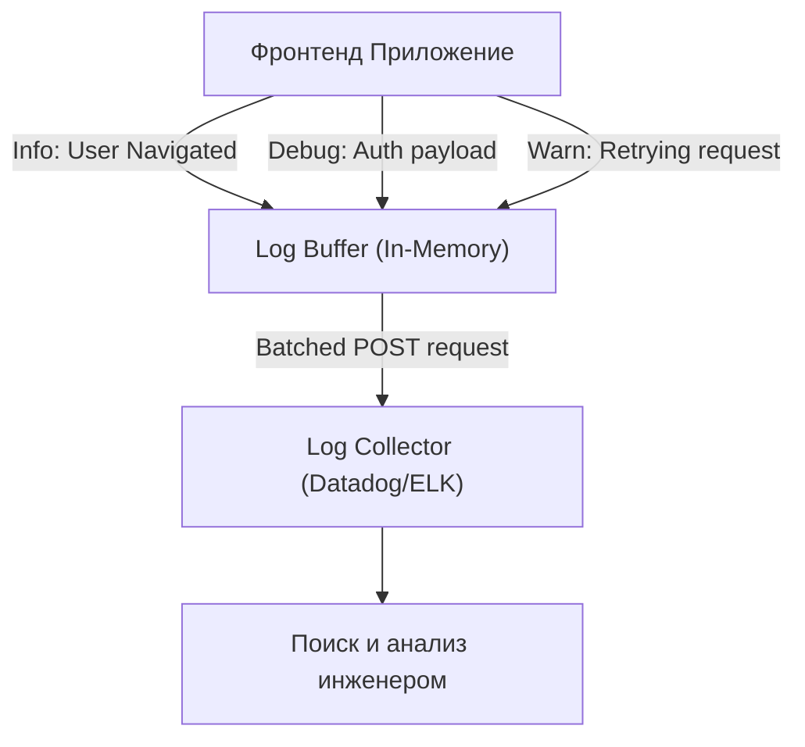

# Logging (Логирование)

## Что это и какую боль мы решаем?
Логирование — это запись хронологии событий, происходящих в приложении. 
**Боль:** Когда происходит инцидент (например, пользователь не может оформить заказ), Error Tracking покажет саму ошибку, но он не покажет *путь* пользователя. Логи дают ответ на вопросы: "Какие шаги привели к этому состоянию?", "Что ответил сервер за 5 секунд до падения?", "Сработал ли механизм ретраев?". Без логов дебаггинг превращается в угадывание.

## Как это работает

На фронтенде классические `console.log` бесполезны — они остаются в браузере пользователя. Для Observability логи нужно отправлять на бэкенд (Log Management System типа ELK, Datadog, Splunk).



## Примеры кода

**Антипаттерн:** Отправлять каждый лог отдельным HTTP-запросом и логировать объекты целиком.

```typescript
// ❌ АНТИПАТТЕРН: Убиваем сеть пользователя и шлем мусор
function onLogin(userObj) {
  // Отправит огромный объект, перегрузит сеть и съест лимиты SaaS-логгера
  fetch('/api/logs', { method: 'POST', body: JSON.stringify({ level: 'info', data: userObj }) });
}
```

**Правильное решение:** Использовать батчинг (накопление) логов и санитаризацию.

```typescript
// ✅ ПРАВИЛЬНО: Использование библиотеки-логгера с батчингом
import { datadogLogs } from '@datadog/browser-logs';

datadogLogs.logger.info('User logged in', {
  userId: user.id, // Только необходимые ID, а не весь объект
  authProvider: 'google',
  durationMs: 150
});
```

## Неочевидные нюансы и границы применимости
- **Утечка PII (Personal Identifiable Information):** Самая страшная ошибка в логировании — случайно залогировать пароли, номера кредиток или токены. Регуляторы (GDPR, HIPAA) за это сильно штрафуют. На уровне SDK логгера должны быть настроены Redactors, заменяющие `/password=.+/` на `***`.
- **Затраты:** Хранение логов стоит дорого. В отличие от бэкенда, фронтенд-логов в миллионы раз больше (каждый клик от миллионов юзеров). Никогда не пишите логи уровня `DEBUG` или `INFO` с фронтенда в продакшен без сэмплирования (отправки логов только от 1% пользователей или только при возникновении ошибки).
- **Ненадежность сети:** Если пользователь закроет вкладку, логи в буфере пропадут. Используйте `navigator.sendBeacon()` для отправки последних логов при `unload`.
