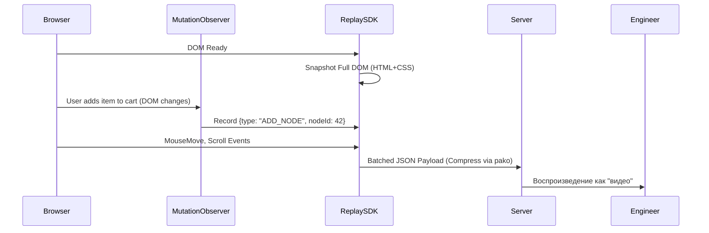

# Session Replay (Запись сессий)

## Что это и какую боль мы решаем?
Session Replay — это инструмент, который записывает действия пользователя на странице и позволяет воспроизвести их в виде видеоролика. 
**Боль:** Пользователь жалуется: "Я нажимаю на кнопку, а ничего не происходит". В логах пусто. В Sentry ошибок нет. Вы пытаетесь воспроизвести баг на своем компьютере — всё работает (эффект "works on my machine"). Session Replay позволяет буквально "посмотреть глазами пользователя", увидеть, куда он кликал, как вел мышь, и что именно происходило на экране в момент бага.

## Как это работает

Никакое реальное видео (mp4) не записывается — это убило бы канал пользователя. Инструменты (LogRocket, Datadog RUM, Sentry Replay, FullStory) записывают изначальное дерево DOM (Snapshot) и все последующие мутации через `MutationObserver` в виде JSON событий. На сервере этот JSON проигрывается в песочнице, перестраивая DOM шаг за шагом.



## Примеры интеграции

**Антипаттерн:** Включить Session Replay на 100% пользователей без настройки приватности. Это приведет к утечке паролей, личных переписок и данных банковских карт прямо в логи SaaS-провайдера.

**Правильное решение:** Строгое маскирование (Masking) всех текстовых полей по умолчанию.

```typescript
// ✅ ПРАВИЛЬНО: Настройка Sentry Replay с приватностью
import * as Sentry from "@sentry/react";

Sentry.init({
  dsn: "https://examplePublicKey@o0.ingest.sentry.io/0",
  replaysSessionSampleRate: 0.1, // Пишем 10% нормальных сессий
  replaysOnErrorSampleRate: 1.0, // Если произошла ошибка — пишем всегда!
  
  integrations: [
    new Sentry.Replay({
      maskAllText: true, // ВЕСЬ текст на странице заменяется на ****
      maskAllInputs: true, // Все инпуты заменяются на ****
      blockAllMedia: true, // Изображения заменяются на плейсхолдеры
    }),
  ],
});
```

## Неочевидные нюансы: трейдоффы и границы применимости
- **Performance Impact:** `MutationObserver` и сжатие JSON на клиенте потребляют процессорное время (Main Thread). На слабых мобильных устройствах включенный Replay может вызвать лаги анимаций и падение FPS.
- **Размер бандла:** Библиотека Session Replay весит довольно много (от 30 до 100 КБ gzip). Рекомендуется загружать ее асинхронно или только для определенного процента пользователей.
- **Синхронизация стилей:** Если в вашем приложении CSS генерируется динамически (CSS-in-JS с уникальными хэшами классов) и вы удаляете старые стили при деплое, то записанная сессия может воспроизвестись криво — DOM будет построен, но стилей для него на сервере уже не окажется.
