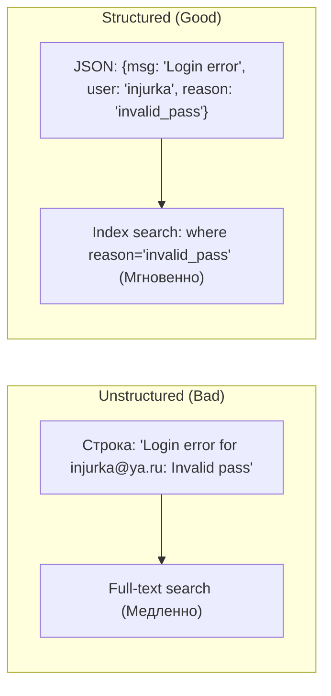

# Structured Logging (Структурированное логирование)

## Что это и какую боль мы решаем?
Структурированное логирование — это подход, при котором логи пишутся не в виде сырого текста (строк), а в виде формализованных JSON-объектов.
**Боль:** Когда вы пишете в лог строку `User 123 failed to purchase item 456 due to Timeout`, человеку это читать удобно. Но когда вам нужно найти в Kibana/Datadog "все ошибки Timeout для товара 456 за вчерашний день", вам придется писать сложные регулярные выражения (RegEx), которые будут тормозить базу данных и ломаться при малейшем изменении формата строки разработчиком. Структурированные логи позволяют индексировать каждое поле отдельно.

## Как это работает

Вместо конкатенации строк, мы передаем логгеру событие (сообщение) и объект с контекстом (Payload / Context). На сервере эти поля становятся полноценными колонками для фильтрации и агрегации.



## Примеры кода

**Антипаттерн:** Использование шаблонных строк для интерполяции переменных в текст сообщения.

```typescript
// ❌ АНТИПАТТЕРН: Текстовый лог. Невозможно агрегировать по paymentId.
const errorMsg = 'Timeout';
const paymentId = 'pay_999';
logger.error(`Payment failed for id ${paymentId}. Reason: ${errorMsg}`);
```

**Правильное решение:** Статичное сообщение, описывающее само событие (Event Name), и объект с динамическими данными.

```typescript
// ✅ ПРАВИЛЬНО: Структурированный JSON.
// В Datadog можно будет отфильтровать: @context.reason:Timeout
logger.error('Payment Processing Failed', {
  paymentId: 'pay_999',
  reason: 'Timeout',
  userId: user.id,
  cartTotal: 1500
});
```

## Неочевидные нюансы и границы применимости
- **Мусор в индексах (Mapping Explosion):** Если разработчики начнут пихать в структурированный лог объекты с динамическими ключами (например, `{ [userId]: { status: "ok" } }`), ElasticSearch создаст колонку для каждого юзера. Это приведет к падению кластера логов. Ключи в JSON должны быть статичными.
- **Глубина вложенности:** Старайтесь не делать объекты логов глубже 1-2 уровней. Плоская структура (`user_id`, `user_role`) индексируется быстрее и ищется проще, чем глубокая (`user.details.auth.role`).
- **Консистентность нейминга:** Если одна команда пишет `userId`, другая `user_id`, а третья `id` — вы не сможете построить общий график. Нужен строгий словарь событий (Schema / Taxonomy).
