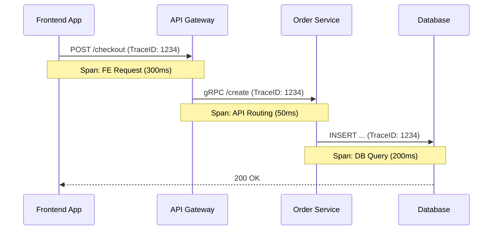

# Tracing (Распределенная трассировка)

## Что это и какую боль мы решаем?
Tracing (или Distributed Tracing) — это метод отслеживания пути одного запроса через все микросервисы и слои приложения.
**Боль:** Пользователь нажимает "Оформить заказ", и кнопка крутится 10 секунд. Почему? Фронтенд работает медленно? API Gateway тупит? Сервис корзины ждет ответа от базы данных? Или сторонний эквайринг (Stripe/Тинькофф) тормозит? Логи каждого отдельного сервиса не дадут ответа, потому что их невозможно связать воедино. Трассировка решает эту проблему, визуализируя запрос как единый "водопад" (Waterfall).

## Как это работает

Когда фронтенд инициирует действие (например, HTTP запрос), он генерирует уникальный `Trace ID` и `Span ID`. Этот ID передается в заголовках запроса (`traceparent` или `X-B3-TraceId`). Бэкенд читает этот заголовок, привязывает к нему свои логи, создает новые дочерние "спаны" (Spans) для запросов в БД и передает ID дальше по цепочке. 



## Примеры интеграции (OpenTelemetry)

**Антипаттерн:** Изобретать собственные заголовки (`X-My-Correlation-Id`) и вручную прокидывать их через каждый `fetch`. Это не будет работать с готовыми APM системами и сторонними библиотеками.

**Правильное решение:** Использовать стандарт W3C Trace Context и библиотеки OpenTelemetry, которые патчат `fetch` и `XMLHttpRequest` автоматически.

```typescript
// ✅ ПРАВИЛЬНО: Инициализация OpenTelemetry на фронтенде
import { WebTracerProvider } from '@opentelemetry/sdk-trace-web';
import { FetchInstrumentation } from '@opentelemetry/instrumentation-fetch';
import { registerInstrumentations } from '@opentelemetry/instrumentation';

const provider = new WebTracerProvider();
provider.register();

// Автоматически добавляет W3C заголовки (traceparent) во все fetch-запросы
registerInstrumentations({
  instrumentations: [
    new FetchInstrumentation({
      // Игнорируем запросы к аналитике, чтобы не мусорить в трейсах
      ignoreUrls: [/amplitude\.com/, /sentry\.io/],
    }),
  ],
});
```

## Неочевидные нюансы и трейдоффы
- **CORS ограничения:** Если фронтенд делает запрос к `api.example.com` (другой домен), и пытается добавить кастомный заголовок `traceparent`, браузер отправит `OPTIONS` запрос (Preflight). Если бэкенд не разрешает `Access-Control-Allow-Headers: traceparent`, запрос упадет.
- **Оверхед на сеть:** Инструментация оборачивает все запросы и отправляет спаны на коллектор. Если спанов слишком много, это замедлит само приложение. В трейсинге почти всегда применяется агрессивное **сэмплирование (Sampling)**: на сервера отправляется только 1-5% всех трейсов или 100% трейсов с ошибками (Tail-based sampling).
- **Сложность развертывания:** Трейсинг бесполезен, если хоть один микросервис в цепочке не поддерживает передачу контекста (Context Propagation) — трейс разорвется на две независимые части.
