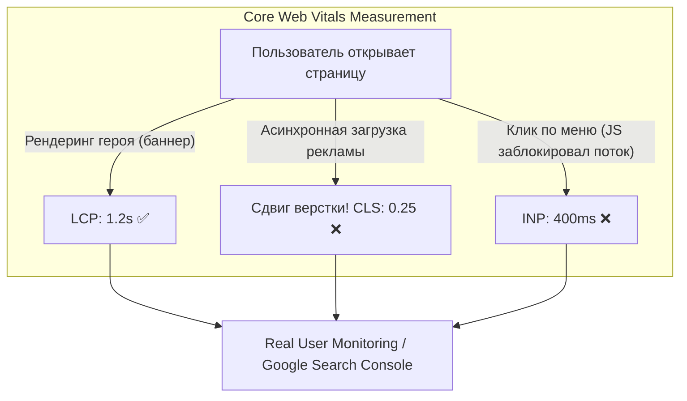

# Web Vitals Monitoring (Мониторинг Web Vitals)

## Что это и какую боль мы решаем?
Web Vitals — это инициатива Google, стандартизирующая метрики качества пользовательского опыта (UX) на веб-странице. Главные из них (Core Web Vitals) влияют на SEO-ранжирование.
**Боль:** Раньше мы измеряли `window.onload`. Но событие `load` может сработать быстро, а пользователь при этом видит белый экран, пока JS не отрендерит React-компоненты. Или наоборот, текст появился мгновенно, но при попытке скролла страница "тормозит". Web Vitals измеряют не техническое время загрузки, а субъективный *пользовательский опыт*.

## Как это работает

Core Web Vitals состоят из трех столпов:
1. **LCP (Largest Contentful Paint):** Скорость загрузки самого большого элемента (картинки, блока текста). Должна быть < 2.5 сек.
2. **INP (Interaction to Next Paint):** Отзывчивость. Время от клика до визуального отклика интерфейса. Должно быть < 200 мс. *(Заменило FID).*
3. **CLS (Cumulative Layout Shift):** Визуальная стабильность. Насколько элементы "прыгают" при подгрузке контента. Должен быть < 0.1.

Браузер (Chrome) сам считает эти метрики и отдает их через API `PerformanceObserver`.



## Примеры сбора метрик

**Антипаттерн:** Полагаться только на Lighthouse (Lighthouse CI) в синтетических тестах. На мощном макбуке в CI-раннере LCP всегда будет хорошим, но у реальных пользователей в метро на старых Android он будет ужасным.

**Правильное решение:** RUM (Real User Monitoring). Сбор Web Vitals прямо у пользователей с помощью официальной библиотеки `web-vitals` и отправка в аналитику.

```typescript
// ✅ ПРАВИЛЬНО: Сбор Core Web Vitals и отправка в аналитику
import { onLCP, onINP, onCLS } from 'web-vitals';

function sendToAnalytics(metric) {
  // Отправляем метрику в Google Analytics или кастомный эндпоинт
  const body = JSON.stringify({
    name: metric.name,          // 'LCP', 'CLS', 'INP'
    value: metric.value,        // Числовое значение
    rating: metric.rating,      // 'good', 'needs-improvement', 'poor'
    navigationType: metric.navigationType // 'navigate', 'reload', 'back-forward'
  });
  
  // Используем sendBeacon, чтобы запрос ушел даже при закрытии вкладки
  navigator.sendBeacon('/analytics/vitals', body);
}

onCLS(sendToAnalytics);
onINP(sendToAnalytics);
onLCP(sendToAnalytics);
```

## Неочевидные нюансы и трейдоффы
- **Поддержка браузерами:** `PerformanceObserver` для Web Vitals полноценно работает только в Chromium-браузерах (Chrome, Edge, Яндекс.Браузер). В Safari и Firefox данные по некоторым метрикам (особенно INP и LCP) собрать невозможно.
- **Шум в данных (SPA):** В Single Page Applications (React, Vue) переход по роутам не вызывает перезагрузку страницы. Стандартные метрики Web Vitals рассчитаны на классические MPA. Для SPA необходимо использовать экспериментальные метрики "Soft Navigation", иначе LCP будет считаться только для первой загрузки приложения.
- **Отладка CLS:** Сдвиг макета (CLS) сложно отладить по одной цифре. Нужно логировать не только значение, но и `metric.entries`, чтобы понять, какой именно DOM-узел "прыгнул".
