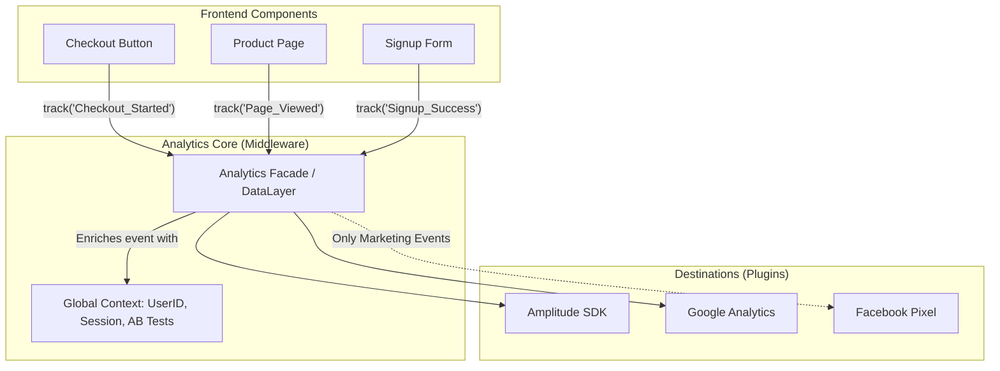

# Analytics Architecture (Архитектура продуктовой аналитики)

## Что это и какую боль мы решаем?
Архитектура аналитики — это то, как приложение собирает, буферизует и доставляет события бизнес-логики (клики, покупки, просмотры) до хранилища данных (Amplitude, Mixpanel, Google Analytics, ClickHouse).
**Боль:** Если каждый компонент шлет события напрямую в Amplitude через их SDK, вы получаете жесткую связанность (tight coupling). Если завтра бизнес решит сменить Amplitude на Mixpanel, вам придется переписать сотни файлов. Если появится требование отправлять покупки еще и в Facebook Pixel, вам придется дублировать код в каждом компоненте.

## Как это работает: Изоляция через абстракции

Правильная архитектура строится вокруг центральной шины событий (Event Bus / Analytics Middleware). Компоненты ничего не знают о конечных системах: они просто объявляют "Произошло событие X". Центральный класс (Tracker) перехватывает событие, обогащает его глобальным контекстом (user_id, platform, ab_test_variant) и веером рассылает в нужные системы (Destinations).



## Примеры архитектуры

**Антипаттерн:** Использование специфичных SDK прямо в UI компонентах.

```typescript
// ❌ АНТИПАТТЕРН: Жесткая привязка к вендору
import amplitude from 'amplitude-js';
import ReactGA from 'react-ga';

const BuyButton = () => {
  const handleBuy = () => {
    amplitude.getInstance().logEvent('Buy Clicked');
    ReactGA.event({ category: 'Ecommerce', action: 'Buy' });
    // А если добавится еще 3 системы?
  };
  return <button onClick={handleBuy}>Купить</button>;
};
```

**Правильное решение:** Паттерн Фасад и Плагины (Destinations).

```typescript
// ✅ ПРАВИЛЬНО: Абстрактный трекер
// 1. Инициализация (где-то в точке входа)
export const analytics = new AnalyticsManager({
  plugins: [
    new AmplitudePlugin('API_KEY'),
    new GoogleAnalyticsPlugin('G-12345')
  ],
  globalProperties: () => ({ platform: 'web', version: '1.0' })
});

// 2. Использование в компоненте
import { analytics } from '@/lib/analytics';

const BuyButton = ({ product }) => {
  const handleBuy = () => {
    // UI ничего не знает о том, КУДА уйдут данные
    analytics.track('Order_Completed', { productId: product.id, price: product.price });
  };
  return <button onClick={handleBuy}>Купить</button>;
};
```

## Неочевидные нюансы и границы применимости
- **AdBlockers (Блокировщики рекламы):** Около 30-40% пользователей используют AdBlock, который режет запросы к доменам `amplitude.com` или `google-analytics.com`. Если вы отправляете важные финансовые метрики с клиента, вы потеряете 40% данных. Решение: **Server-Side Tracking** или проксирование запросов через собственный домен (First-Party Data Collection).
- **Offline и Retry механизмы:** Пользователь кликнул "Купить" в метро, сеть пропала. Аналитика не ушла. Хорошая архитектура должна сохранять события в `IndexedDB` или `localStorage` и ретраить их при появлении сети (`navigator.onLine`).
- **Синхронизация сессий:** Фронтенд-события и бэкенд-события (например, списание денег) должны склеиваться в одну сессию. Для этого фронтенд должен генерировать и прокидывать `Session ID` или `Device ID` в API запросы к бэкенду.
