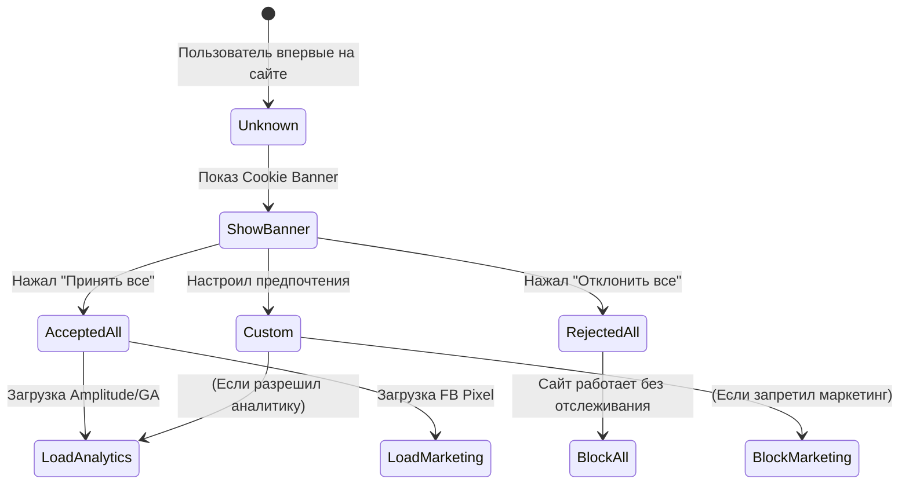

# Consent Management (Управление согласием)

## Что это и какую боль мы решаем?
Consent Management — это процесс получения, хранения и управления согласием пользователя на сбор, обработку и передачу его персональных данных и использование файлов cookie.
**Боль:** Законодательство (GDPR в Европе, CCPA в Калифорнии, ФЗ-152 в России) строго запрещает отслеживать пользователя без его явного и осознанного согласия. Если вы загрузите скрипт Google Analytics до того, как пользователь нажал "Принимаю" на куки-баннере, компания может получить многомиллионный штраф. Consent Management автоматизирует эту рутину.

## Как это работает

Приложение не имеет права запускать трекинг-скрипты по умолчанию. Вместо этого, загрузка аналитики оборачивается в логику проверки состояния согласия. Пользователю показывается баннер (Consent Management Platform - CMP, например, OneTrust, Cookiebot). Когда пользователь выбирает настройки (например, разрешает аналитику, но запрещает маркетинговые пиксели), CMP сохраняет выбор в специальную куку и бросает событие в `window`.



## Примеры интеграции (Google Consent Mode)

**Антипаттерн:** Жестко блокировать загрузку скрипта Google Analytics, если нет согласия. Из-за этого вы вообще потеряете информацию о том, что был визит на сайт (даже анонимный).

**Правильное решение:** Использовать Advanced Consent Mode. Скрипты загружаются сразу, но им передается флаг "согласия нет". В таком режиме GA отправляет *пинг без кук* (cookieless ping), не нарушая GDPR, но позволяя собирать базовую статистику визитов (через вероятностное моделирование).

```html
<!-- ✅ ПРАВИЛЬНО: Интеграция Consent Mode перед загрузкой GTM -->
<script>
  window.dataLayer = window.dataLayer || [];
  function gtag(){dataLayer.push(arguments);}
  
  // Устанавливаем дефолтное состояние: всё запрещено!
  gtag('consent', 'default', {
    'ad_storage': 'denied',
    'analytics_storage': 'denied'
  });
</script>

<!-- Загрузка скрипта CMP баннера (например, Cookiebot) -->
<script id="Cookiebot" src="https://consent.cookiebot.com/uc.js" ...></script>

<!-- Когда пользователь согласится, CMP сам вызовет:
  gtag('consent', 'update', {
    'analytics_storage': 'granted'
  });
-->
```

## Неочевидные нюансы: трейдоффы и границы применимости
- **Dark Patterns (Темные паттерны UX):** Законодательство (GDPR) требует, чтобы кнопка "Отклонить все" была такой же заметной, как "Принять все". Прятать отказ за 5 кликами в меню настроек — незаконно.
- **Удаление кук при отзыве согласия:** Пользователь имеет право в любой момент отозвать согласие. Ваш код должен не только перестать слать новые события, но и **удалить** уже установленные куки аналитики (`_ga`, `amp_id`).
- **Снижение конверсии:** Внедрение строгого Consent-баннера в Европе (где пользователи часто отказываются) может "убить" от 30% до 50% трафика в ваших отчетах Google Analytics. Маркетологи будут в панике, думая, что трафик упал, хотя люди просто не приняли куки.
