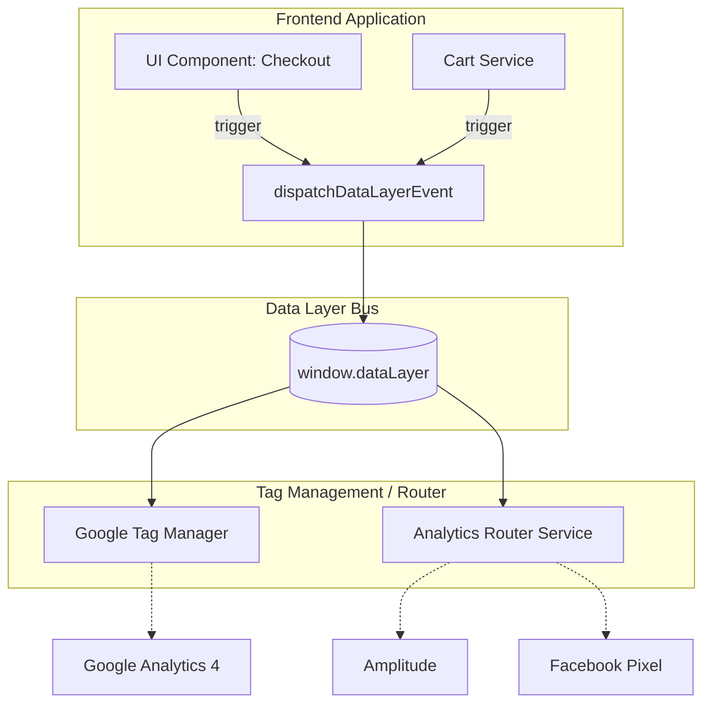

# Data Layer (Слой данных)

## Суть концепции

**Data Layer (Слой данных)** — это паттерн архитектуры фронтенда, обеспечивающий единую, структурированную прослойку (обычно это массив или объект в глобальной области видимости, например `window.dataLayer`), в которую приложение скидывает сырые события и бизнес-данные.

Вместо того чтобы компоненты приложения напрямую обращались к SDK различных систем аналитики (Google Analytics, Яндекс.Метрика, Amplitude, Facebook Pixel), они отправляют данные в Data Layer. А уже из Data Layer данные забираются (или роутятся) менеджером тегов (например, GTM) или специальным сервис-адаптером.

## Какую боль мы решаем?

1. **Vendor Lock-in и дублирование кода.** Без Data Layer добавление новой аналитической системы означает переписывание кода по всему приложению. Клик по кнопке "Купить" будет содержать 5 вызовов разных трекеров.
2. **Рассинхронизация форматов (Spaghetti Data).** Каждый трекер ожидает данные в своем формате (Amplitude любит snake_case, GA4 — специфичные ключи). Разработчики начинают хардкодить трансформации прямо в React/Vue компонентах.
3. **Хрупкость при редизайнах.** Маркетологи часто вешают события в GTM по CSS-классам или ID кнопок. Разработчик меняет верстку, класс пропадает — аналитика отваливается, бизнес теряет данные. С Data Layer события генерируются кодом логики, а не привязываются к верстке.

## Как это работает на практике

Архитектура строится на принципе Event Bus (шины событий). Приложение только "публикует" (push) информацию о том, что произошло. Как эту информацию обработать — забота интеграционного слоя.



### Примеры кода

**Антипаттерн: Прямые вызовы аналитики из компонентов**
Жесткая привязка логики отображения к вендорам аналитики.

```typescript
// Плохо: Компонент знает слишком много
function AddToCartButton({ product }) {
  const handleClick = () => {
    // Дублирование, vendor lock-in, загрязнение UI
    window.ga('send', 'event', 'Ecommerce', 'AddToCart', product.name);
    window.amplitude.getInstance().logEvent('Added to Cart', { price: product.price });
    window.ym(123456, 'reachGoal', 'add_to_cart');
    
    addToCart(product);
  };

  return <button onClick={handleClick}>Купить</button>;
}
```

**Паттерн: Использование абстрактного Data Layer**
Компонент просто заявляет: "случилось событие". Он отправляет стандартизированный payload.

```typescript
// Хорошо: Изоляция через сервис
// analytics.service.ts
export const pushEvent = (eventName: string, payload: any) => {
  window.dataLayer = window.dataLayer || [];
  window.dataLayer.push({
    event: eventName,
    ...payload,
    timestamp: Date.now()
  });
};

// Component
function AddToCartButton({ product }) {
  const handleClick = () => {
    pushEvent('ecommerce_add_to_cart', {
      product_id: product.id,
      product_category: product.category,
      price: product.price
    });
    
    addToCart(product);
  };

  return <button onClick={handleClick}>Купить</button>;
}
```

## Неочевидные нюансы и трейдоффы

1. **Гонка состояний (Race Conditions).** Если приложение пушит события в Data Layer до того, как загрузился и инициализировался GTM или роутер, события могут потеряться.
   * **Решение:** Использовать массив (`[]`) как основу для `window.dataLayer`. Приложение делает `.push()`. Когда GTM загружается, он переопределяет метод `push` массива, чтобы перехватывать новые события, а уже накопленные в массиве — обрабатывает разом.
2. **Мутация данных (State Mutation).** В классическом GTM `dataLayer` — это не только события, но и хранилище состояния (например, `user_id`, `page_type`). При отправке нового события старые ключи сливаются с новыми. Если не очищать переменные, данные от предыдущего события могут ошибочно приклеиться к новому.
   * **Правило:** Явно сбрасывайте состояние или используйте уникальные неймспейсы для контекста событий.
3. **Размер Payload'а.** Маркетологи могут просить "передавать всё". Это приводит к тому, что в каждом событии передается огромный JSON, что тратит трафик пользователя и память. 
   * **Границы применимости:** Формируйте строгую таксономию событий (Event Taxonomy). В Data Layer должны попадать только те данные, которые действительно нужны для аналитики, а не весь state приложения. Опишите контракты (TS Interfaces) для событий.
