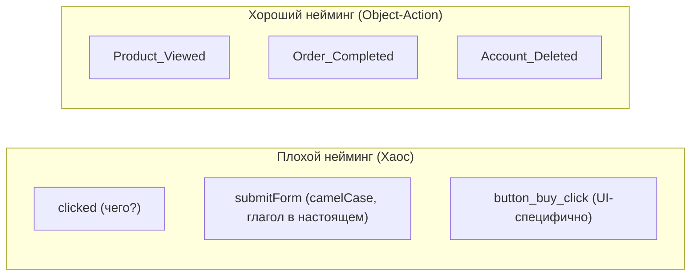

# Event Naming (Именование событий)

## Что это и какую боль мы решаем?
Event Naming — это свод правил (конвенция) о том, как называются события, которые фронтенд отправляет в аналитику.
**Боль:** Один разработчик назвал событие `click_buy`, второй — `BuyButtonClicked`, третий — `order completed`. Через полгода аналитик пытается построить воронку продаж и обнаруживает в базе 50 разных событий, которые значат одно и то же. Отчеты становятся неверными, данные — мусорными (Garbage In, Garbage Out). Строгий нейминг делает данные читаемыми и предсказуемыми.

## Как это работает: Object-Action Framework

Самый популярный и масштабируемый паттерн нейминга — **Object-Action** (Имя существительное + Глагол в прошедшем времени). 
Формат: `[Object]_[Action]` или `[Category]_[Object]_[Action]`. Событие всегда описывает то, что *уже произошло*.



## Примеры из практики

**Антипаттерн:** Привязывать название события к элементам интерфейса (UI). Если завтра дизайнер поменяет "Кнопку" на "Свайп", событие `Button_Clicked` потеряет смысл.

```typescript
// ❌ АНТИПАТТЕРН: Привязка к UI и разный регистр
analytics.track('green_button_click');
analytics.track('Submit Order');
```

**Правильное решение:** Описывать бизнес-смысл действия пользователя, используя единый регистр (например, PascalCase или snake_case).

```typescript
// ✅ ПРАВИЛЬНО: Описание бизнес-сути в формате Object_Action
const completeCheckout = () => {
  // Независимо от того, кнопка это, свайп или голосовая команда
  analytics.track('Checkout_Completed', {
    payment_method: 'card',
    total_amount: 1500
  });
};
```

## Неочевидные нюансы: трейдоффы и границы применимости
- **Свойства против Событий:** Не создавайте события под каждый сценарий (например, `Product_Viewed_Shoes`, `Product_Viewed_Hats`). Событие должно быть одним (`Product_Viewed`), а детализация должна передаваться в свойствах (`{ category: 'shoes' }`).
- **Глобальный реестр:** Правила нейминга бесполезны, если они не задокументированы. В зрелых командах используется Tracking Plan (например, в Avo или Excel-таблице), а на фронтенде генератор типов (TypeScript) не даст вам отправить событие, которого нет в словаре.
- **Длина названия:** В некоторых системах (например, старые версии Firebase) есть лимит на длину названия события (40 символов). Учитывайте это при формировании `[Category]_[Object]_[Action]`.
