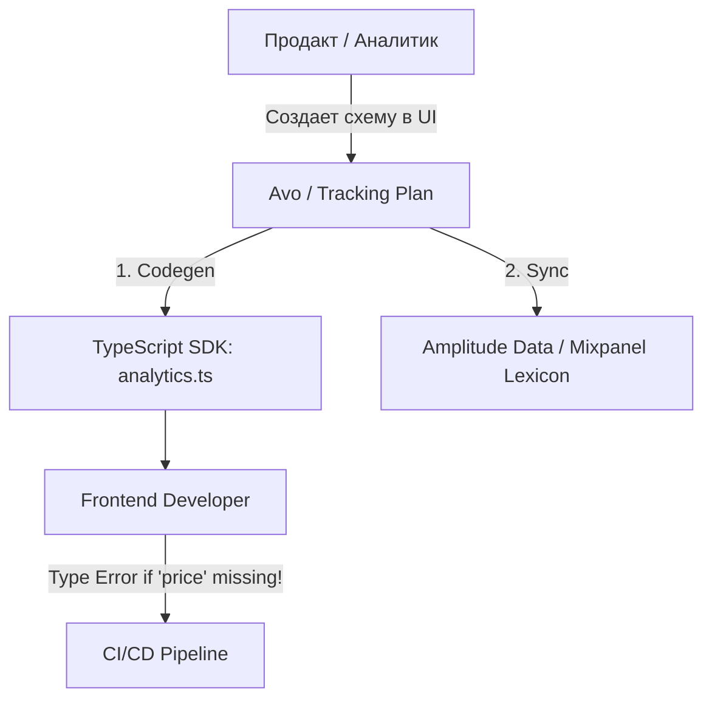

# Event Taxonomy (Таксономия событий)

## Что это и какую боль мы решаем?
Таксономия событий (Tracking Plan) — это "схема данных" вашей аналитики. Это единый источник истины (Single Source of Truth), который описывает: какие события существуют, когда они должны отправляться, и какие параметры (Properties) обязаны в них лежать.
**Боль:** Фронтендер отправил событие `Order_Completed`, но забыл положить туда `revenue` (выручку). В итоге дашборд финансов за день показал 0 рублей, и CEO поднял панику. Без строгой таксономии фронтенд отправляет то, что считает нужным, а аналитики страдают от неполных или нетипизированных данных.

## Как это работает

Таксономия обычно хранится вне кода (в инструментах вроде Avo, Iterative.ly или просто в Google Sheets). Из этого источника автоматически генерируются TypeScript-типы или классы, которые фронтендеры используют в коде. Таким образом, ошибка аналитики превращается в ошибку компиляции.



## Примеры кода: Type-Safe Analytics

**Антипаттерн:** Использование `any` или `Record<string, any>` для свойств событий. Разработчик может опечататься (написать `curency` вместо `currency`), и компилятор промолчит.

```typescript
// ❌ АНТИПАТТЕРН: Никаких гарантий структуры данных
function trackEvent(name: string, properties: any) {
  amplitude.logEvent(name, properties);
}

// Опечатка в property! Аналитик не найдет 'productId'.
trackEvent('Product_Added', { product_id: 123 });
```

**Правильное решение:** Жесткая типизация на основе Таксономии.

```typescript
// ✅ ПРАВИЛЬНО: Строгие типы, сгенерированные из Таксономии
type AnalyticsEvents = {
  'Product_Added': { productId: string; price: number; currency: 'USD' | 'EUR' };
  'Checkout_Started': { cartValue: number; itemsCount: number };
};

function track<K extends keyof AnalyticsEvents>(event: K, props: AnalyticsEvents[K]) {
  amplitude.logEvent(event, props);
}

// IDE подсветит ошибку: Property 'price' is missing
track('Product_Added', { productId: "123", currency: "USD" }); 
```

## Неочевидные нюансы и границы применимости
- **Сложность поддержки:** Поддержание актуальной Таксономии требует дисциплины. Если добавление одной кнопки в UI требует согласования события с аналитиком в течение недели, продуктовая разработка встанет. Процесс должен быть асинхронным и быстрым.
- **Версионирование событий:** Если бизнес-логика изменилась (например, `price` теперь передается не в долларах, а в центах), нельзя просто поменять тип. Старые версии мобильных приложений продолжат слать старый формат. Нужно либо версионировать событие (`Product_Added_v2`), либо поддерживать оба типа на уровне ETL-пайплайна.
- **Ограничения типов:** Некоторые свойства (User Agent, URL, Timestamp) должны добавляться глобально на уровне SDK, а не передаваться вручную в каждом `track()` вызове.
