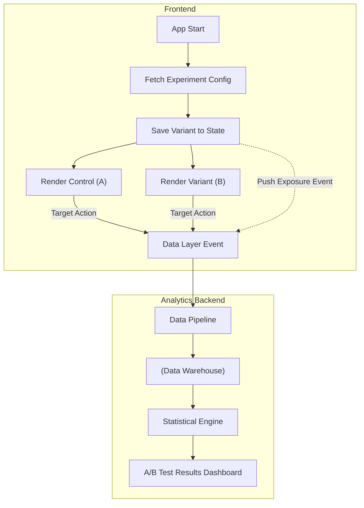

# Experiment Analytics (Аналитика экспериментов / A/B тестирование)

## Суть концепции

**Аналитика экспериментов** — это инженерный и статистический подход к валидации продуктовых гипотез. Вместо того чтобы гадать, какой цвет кнопки или алгоритм рекомендаций принесет больше конверсий, аудитория делится на когорты (например, Контрольная группа "A" и Экспериментальная группа "B"). 

На фронтенде этот процесс подразумевает не только отображение разных вариантов UI, но и корректный сбор данных о том, в какую группу попал пользователь, чтобы дата-саентисты смогли рассчитать статистическую значимость (p-value) результатов.

## Какую боль мы решаем?

1. **Эффект Хиппо (HiPPO - Highest Paid Person's Opinion).** Решения принимаются на основе мнения руководства, а не фактов. Эксперименты дают объективную картину (data-driven подход).
2. **Ложноположительные выводы.** Если просто выкатить фичу и посмотреть на метрики "до и после", можно списать сезонный всплеск или маркетинговую рассылку на успех фичи. Параллельное A/B тестирование исключает внешние факторы.
3. **Метрика тщеславия vs Бизнес-метрика.** Без аналитики экспериментов мы видим только, что "на кнопку стали кликать чаще". Но мы не знаем, привело ли это к увеличению среднего чека или, наоборот, к росту отказов на следующем шаге.

## Как это работает на практике

Процесс состоит из трех шагов: **Назначение (Assignment)** -> **Отрисовка (Render)** -> **Отслеживание (Tracking)**.

1. Фронтенд запрашивает у сервиса экспериментов вариант для пользователя.
2. Пользователь видит нужный вариант.
3. Отправляется специальное событие `experiment_viewed`, связывающее пользователя и вариант. Дальнейшие целевые действия (конверсии) соотносятся с этим фактом.



### Примеры кода

**Антипаттерн: Отправка аналитики без учета факта показа (Exposure)**
Метрики собираются по всем пользователям, даже если они не дошли до места эксперимента. Это размывает результаты.

```typescript
// Плохо: Пользователь получил флаг, но мы не знаем, видел ли он UI
function ProductPage() {
  const isRedButton = useExperiment('red_buy_button'); // Мы уже в группе B!

  // Пользователь может уйти со страницы, так и не доскроллив до кнопки, 
  // но в аналитике он будет считаться "участником"
  return (
    <div>
      <Header />
      <Hero />
      <Spacer height="2000px" />
      <Button color={isRedButton ? 'red' : 'blue'}>Купить</Button>
    </div>
  );
}
```

**Паттерн: Трекинг экспозиции (Exposure / Assignment Event)**
Событие участия в эксперименте отправляется строго в момент, когда компонент появился на экране.

```typescript
// Хорошо: Используем Intersection Observer и явный лог участия
function BuyButton() {
  const variant = useExperiment('button_color_test'); 
  const { ref, inView } = useInView();

  useEffect(() => {
    if (inView) {
      // Ключевой момент: логгируем, что юзер РЕАЛЬНО увидел этот вариант
      analytics.track('experiment_viewed', {
        experiment_id: 'button_color_test',
        variant_id: variant
      });
    }
  }, [inView, variant]);

  return (
    <button ref={ref} className={`btn-${variant}`}>
      Купить
    </button>
  );
}
```

## Неочевидные нюансы и трейдоффы

1. **Мерцание контента (Flickering / FOUC).** Пока фронтенд ждет ответа от сервера с вариантом A или B, пользователю нужно что-то показывать. Если показать A, а потом сменить на B, конверсия упадет из-за раздражения.
   * **Решение:** Скрывать экспериментируемый блок скелетоном/спиннером до загрузки конфигурации (но есть оверхед на LCP), либо проводить расчет хэша на основе `userId` прямо на клиенте / edge-воркере (Edge Side Includes).
2. **Грязные данные и боты.** Боты (Googlebot, парсеры) сильно искажают результаты, так как они не совершают конверсий, но накручивают показы.
   * **Границы применимости:** Фронтенд должен фильтровать события (проверять User-Agent на наличие поисковых ботов) или не инициировать эксперименты для пользователей без уникального сгенерированного ID (Device ID/User ID).
3. **Проблема подглядывания (Peeking Problem).** Разработчики и менеджеры любят смотреть на результаты на второй день и говорить "группа Б побеждает, выкатываем". В статистике это ведет к огромной ошибке. Эксперимент должен длиться ровно до тех пор, пока не наберется заранее рассчитанный размер выборки (Sample Size). Фронтенд должен просто исправно слать события, а интерпретировать их должен калькулятор мощности теста.
