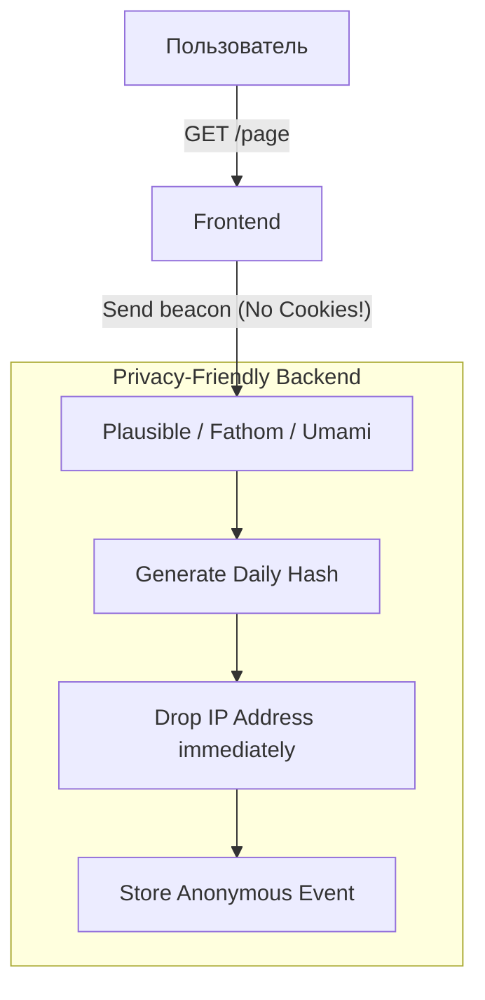

# Privacy-Friendly Analytics (Приватная аналитика)

## Что это и какую боль мы решаем?
Privacy-Friendly Analytics — это подход к сбору данных о поведении пользователей, который изначально (by design) не нарушает приватность, не собирает PII (Personal Identifiable Information) и не требует согласия на использование Cookie (в рамках GDPR/ePrivacy).
**Боль:** Большинство компаний используют Google Analytics по привычке. В результате они обязаны показывать пользователям огромные раздражающие Cookie-баннеры. Многие пользователи нажимают "Отклонить", и компания вообще теряет данные о посещаемости. Приватная аналитика позволяет собирать базовые метрики (просмотры страниц, рефереры) на 100% аудитории без баннеров и нарушения законов.

## Как это работает

Вместо использования постоянных идентификаторов (`user_id` в cookies), которые отслеживают пользователя между сайтами (Cross-site tracking), приватная аналитика использует кратковременные хэши.

**Формула анонимного хэша:**
`Hash(IP Address + User Agent + Salt(меняется каждые 24 часа))`

Этот хэш позволяет связать просмотры страниц в рамках одного дня (понять, что это один человек, а не 10 разных), но на следующий день тот же пользователь получит совершенно новый хэш. Построить его профиль за год невозможно.



## Примеры реализации

В качестве альтернативы монструозному Google Analytics часто используют **Plausible Analytics**, **Fathom** или **Umami**.

**Антипаттерн:** Использовать тяжелые SDK (типа `gtag.js` размером 50 КБ) для того, чтобы просто посмотреть, сколько человек зашло на сайт, попутно отдавая данные корпорации для таргетинга рекламы.

**Правильное решение:** Использование легковесного скрипта (< 1 КБ), который не читает и не пишет cookies.

```html
<!-- ✅ ПРАВИЛЬНО: Интеграция Plausible Analytics -->
<head>
  <!-- Скрипт весит всего 0.7 KB, не требует Cookie-баннера -->
  <script defer data-domain="my-startup.com" src="https://plausible.io/js/script.js"></script>
</head>
```

```typescript
// Отправка кастомного события без передачи приватных данных
export const trackGoal = (goalName: string) => {
  if (window.plausible) {
    window.plausible(goalName);
  }
};
// Использование: trackGoal('Signup_Clicked')
```

## Неочевидные нюансы: трейдоффы и границы применимости
- **Отсутствие воронок и Retention:** Приватная аналитика не позволяет построить когортный анализ (Retention) за месяц, потому что идентификаторы пользователей сбрасываются каждый день. Вы не узнаете, вернулся ли пользователь через неделю.
- **Ограниченная ценность для E-commerce:** Если у вас интернет-магазин, вам нужно отслеживать LTV (Lifetime Value) пользователя и источники трафика (UTM), которые привели к покупке через месяц после первого визита. Приватная аналитика здесь бессильна.
- **Идеально для:** Блогов, лендингов, документации, опенсорс-проектов и SaaS на ранних стадиях, где важны общие тренды трафика ("Какая статья популярнее?"), а не слежка за конкретным индивидом.
