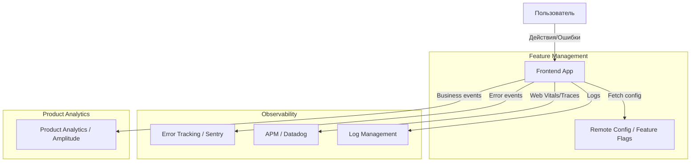

# Observability, аналитика и эксплуатация

## Что это и какую боль мы решаем?
Когда фронтенд-приложение попадает в production, оно начинает жить своей жизнью на устройствах тысяч пользователей с разным качеством сети, браузерами и непредсказуемым поведением. Без правильно настроенных инструментов наблюдения (observability) и аналитики мы летим "вслепую". Если у пользователя белый экран, мы об этом не узнаем, пока он не напишет в саппорт. Если фича не приносит денег, мы будем продолжать ее развивать, опираясь лишь на интуицию. 

Этот раздел объединяет три фундаментальных столпа: **Observability** (мониторинг технического здоровья: ошибки, логи, перфоманс), **Product Analytics** (поведение пользователей: продуктовые метрики, воронки) и **Feature Management** (управление функциональностью в рантайме: фича-флаги, A/B тесты).

## Как это работает на практике

## Неочевидные нюансы и трейдоффы
- **Оверхед на бандл и сеть**: Каждая библиотека для трекинга или логгирования увеличивает размер бандла и количество сетевых запросов. Слишком много аналитики убьет перфоманс.
- **Приватность и GDPR**: Мы не можем просто так собирать все данные. Необходимо управлять согласием (Consent Management) и фильтровать PII (Personal Identifiable Information).
- **Шум против Сигнала**: Если логировать всё подряд, алерты перестанут читаться. Ключ к успеху — собирать только actionable данные, по которым можно принять решение или починить баг.
