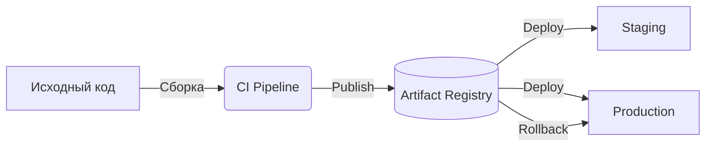

# Управление артефактами (Artifact Management)

Когда ваш CI собрал приложение (например, сгенерировал папку `dist` с минифицированными JS/CSS или собрал Docker-образ), этот результат нужно гдето сохранить. Артефакт — это неизменяемый, готовый к развертыванию пакет кода. Главная боль, которую решает Artifact Management — необходимость пересобирать код при деплое на разные среды (Staging, Production) или при откате (Rollback).

Собранный один раз артефакт становится единым источником правды. Мы двигаем не исходный код между окружениями, а уже готовый бинарник или архив.



**Где это применимо и где ломается:**
Идеально для Docker-образов, NPM-пакетов или даже архивов статики в S3. Проблемы начинаются с **управлением жизненным циклом**: реестры артефактов быстро распухают до терабайтов, если не настроить агрессивный Garbage Collection (удаление старых сборок).

**Антипаттерн (сборка на сервере):**
```yaml
# Плохо: мы собираем код прямо на проде. Зависимости могут скачаться другие.
deploy:
  script:
    - git pull
    - npm install
    - npm run build
```

**Правильное решение:**
```yaml
# Хорошо: скачиваем готовый неизменяемый артефакт
deploy:
  script:
    - aws s3 cp s3://my-artifacts/app-v1.2.3.tar.gz .
    - tar -xzf app-v1.2.3.tar.gz
```
