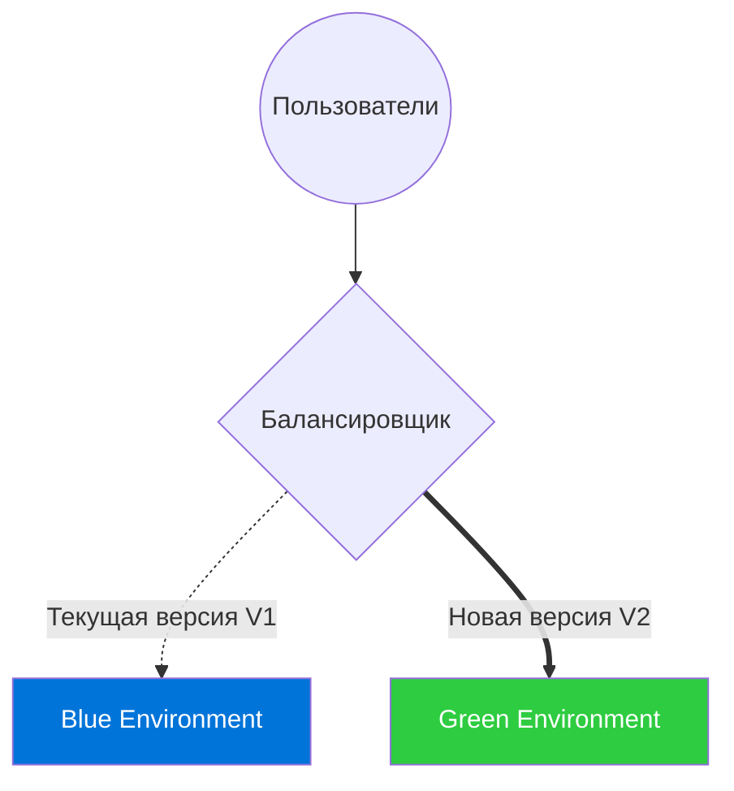

# Blue-Green Deployment

Blue-Green Deployment — это стратегия деплоя, которая позволяет обновлять приложение с **нулевым временем простоя (Zero Downtime)** и мгновенно откатываться назад в случае проблем.

Как это работает: у вас есть две абсолютно идентичные production-среды. "Blue" (синяя) обслуживает текущий пользовательский трафик. Новая версия разворачивается в "Green" (зеленой) среде, которая скрыта от пользователей. Вы спокойно тестируете Green на проде. Когда всё готово, роутер (балансировщик) просто переключает трафик с Blue на Green.



**Скрытые трейдоффы и оверхед:**
Главная боль — это **цена**. Вам нужно держать x2 инфраструктуры в момент деплоя. Для фронтенда это часто решается просто разными папками на CDN/S3 и переключением `index.html`. 
Самая большая проблема Blue-Green — **миграции баз данных**. Если V2 требует новой структуры БД, то переключение трафика сломает старую версию V1, сделав мгновенный откат невозможным. База данных должна быть обратно совместимой на протяжении всего релиза.

**Пример конфигурации роутинга (Nginx):**
```nginx
# Переключение сводится к смене symlink или изменению upstream
upstream backend {
    # server 10.0.0.1:80; # Blue (Old)
    server 10.0.0.2:80; # Green (New)
}
```
