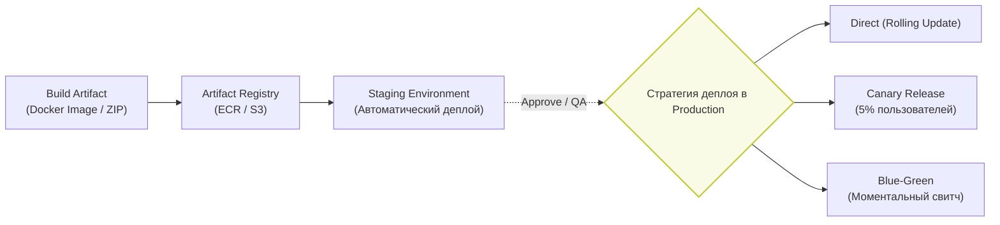

Continuous Delivery (Непрерывная доставка) и Continuous Deployment (Непрерывное развертывание) — это логическое продолжение CI. В то время как CI гарантирует, что код *можно* собрать, CD гарантирует, что его *можно доставить* пользователям надежно, безопасно и без простоев (Zero-downtime).

---

## 1. Архитектура и стратегии CD

Главная боль, которую решает CD — устранение "релизного мандража". Когда релизы происходят раз в месяц вручную, это всегда стресс. Когда деплой автоматизирован и происходит 10 раз в день, это рутина.



### 1.1. Отличие Delivery от Deployment
* **Continuous Delivery (Доставка):** Код автоматически собирается, тестируется и готовится к релизу (загружается в Registry). Деплой на `Production` происходит по нажатию кнопки (Manual Approval).
* **Continuous Deployment (Развертывание):** Любой коммит в `main`, успешно прошедший тесты, автоматически и без вмешательства человека выкатывается на `Production`.

---

## 2. Стратегии развертывания (Deployment Strategies)

### 2.1. Blue-Green Deployment (Сине-зеленое развертывание)
**Как это работает:** Поднимается полностью независимая копия приложения (Green) параллельно с текущей (Blue). На балансировщике (Load Balancer) трафик переключается с Blue на Green мгновенно.
* **Где применимо:** Когда нужно исключить простой (downtime) на 100% и иметь возможность откатиться за секунду, переключив трафик обратно.
* **Где ломается (Трейдофф):** Инфраструктура обходится в 2 раза дороже в момент релиза. Для Frontend-SPA (если раздается с CDN/S3) это работает через переключение указателя (например, тега `latest`) на новый `index.html`.

### 2.2. Canary Releases (Канареечный релиз)
**Как это работает:** Новая версия раскатывается только на малый процент пользователей (например, 5%). Если система мониторинга (Sentry/Datadog) не фиксирует всплеска ошибок, трафик постепенно увеличивается до 100%.
* **Где применимо:** Высоконагруженные B2C продукты, где цена ошибки критична.
* **Где ломается:** Сложно настроить корректную маршрутизацию. Нужно гарантировать "Sticky Sessions" — чтобы пользователь, попавший на канарейку, оставался на ней, а не "прыгал" между старой и новой версиями SPA.

---

## 3. Неочевидные нюансы (Специфика Frontend CD)

### 3.1. Проблема рассогласования (API Versioning)
SPA обновляется в браузере клиента асинхронно. Когда вы делаете CD бэкенда и фронтенда, пользователи, у которых *уже открыта старая вкладка* SPA, продолжат слать старые API-запросы на обновленный бэкенд.
* **Антипаттерн:** Синхронно релизить фронтенд и удалять старые эндпоинты бэкенда.
* **Как надо:** Бэкенд всегда должен поддерживать обратную совместимость API (N-1 версии) минимум несколько дней после деплоя фронтенда.

### 3.2. Кэширование `index.html`
Главная ошибка деплоя SPA на S3/CDN.
```json
// Плохо: закэшировали index.html на CDN
Cache-Control: max-age=86400 // 1 день
```
Если вы выкатите новый билд (с новыми JS/CSS файлами), пользователи целый день будут получать старый `index.html`, который ссылается на старые JS-файлы (которые могут быть уже удалены из хранилища).
* **Как надо:** `index.html` всегда должен отдаваться с директивой `Cache-Control: no-cache`. Сам файл весит килобайты, но гарантирует, что пользователь скачает свежие `main.[hash].js` бандлы, которые закэшированы навечно.

### 3.3. Build Once, Deploy Anywhere (BODA)
**Боль:** Часто для Staging собирают билд с `.env.staging`, а для Production заново запускают `npm run build` с `.env.production`. Это нарушает главный принцип CD: "То, что мы протестировали, то и выкатываем". Второй билд может собраться иначе.
* **Решение:** Фронтенд собирается *один раз* (в образ или бандл). Конфигурация (URL API, ключи) передается в рантайме (через `window.__ENV__`, инжектируемый сервером при отдаче `index.html`).
