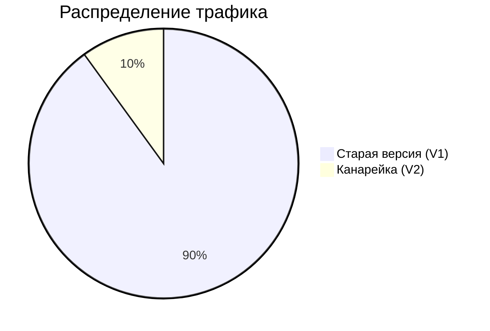
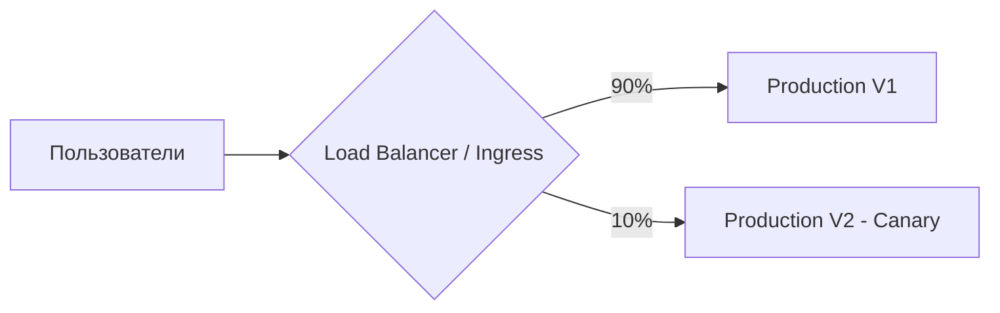

# Канареечный релиз (Canary Deployment)

Название пришло от шахтёров, которые брали с собой в забой канарейку. Если птичка погибала от угарного газа, шахтёры успевали эвакуироваться. В IT Canary Deployment — это когда новая версия приложения раскатывается не на всех сразу, а на малую долю пользователей (например, 5%).

Боль, которую мы решаем: даже после всех тестов релиз может обрушить прод (из-за непредсказуемой нагрузки или специфичных данных пользователей). Выкатывая на 5%, мы рискуем только ими. Если графики ошибок ползут вверх — "канарейка умерла", мы мгновенно сворачиваем релиз до 0%. Если всё хорошо — плавно повышаем до 10%, 50%, 100%.




**Неочевидные нюансы:**
- **Оверхед на метрики:** Канарейка не имеет смысла, если у вас нет безупречного мониторинга. Вы должны *автоматически* сравнивать ошибки V1 и V2.
- **Sticky Sessions:** Важно, чтобы пользователя не кидало между версиями при каждом запросе. Его нужно "прилепить" к канарейке по куке или хешу IP.

**Антипаттерн:**
Делать канарейку, но проверять логи глазами. Это долго и ненадежно.

**Правильное решение (Kubernetes + Istio):**
```yaml
apiVersion: networking.istio.io/v1alpha3
kind: VirtualService
spec:
  http:
  - route:
    - destination:
        host: my-frontend
        subset: v1
      weight: 90
    - destination:
        host: my-frontend
        subset: v2-canary
      weight: 10
```
