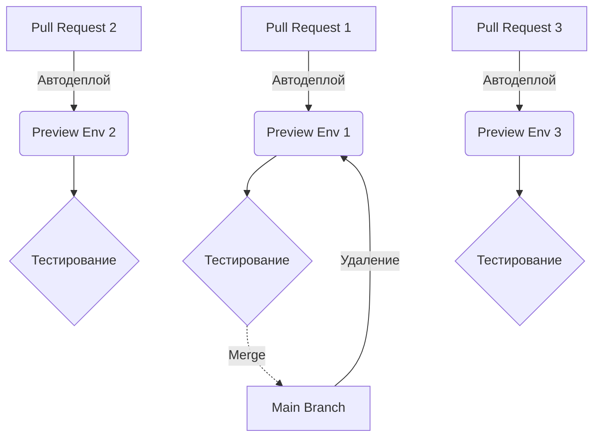

# Эфемерные окружения (Preview Environments)

Preview Environments (или Ephemeral Environments) — это временные, полноценные копии вашего приложения, которые разворачиваются автоматически для каждого Pull Request (PR).

Какую боль мы решаем? Исторически QA-инженеры и продакт-менеджеры стояли в очереди, чтобы потестировать свою фичу на единственном сервере Staging. С Preview-окружениями каждый PR получает уникальную ссылку (например, `pr-123.my-app.com`). Дизайнер может открыть её и проверить верстку, а QA — прогнать автотесты. Как только PR сливается в `main`, окружение уничтожается.



**Скрытые трейдоффы и оверхед:**
- **Базы данных:** Откуда взять данные для Preview? Делать дамп с продакшена долго и небезопасно (GDPR). Вам нужны скрипты сидирования (Seeding) синтетических данных, которые отрабатывают за секунды.
- **Garbage Collection:** Забытые (брошенные) PR могут привести к тысячам работающих окружений, которые сожгут бюджет на AWS/GCP. Нужны строгие правила удаления по TTL.

**Конфигурация (GitHub Actions + Vercel/Netlify):**
Подобные платформы делают это из коробки без боли:
```yaml
# Этого достаточно в Vercel для деплоя каждого PR
name: Vercel Preview
on: [pull_request]
```
