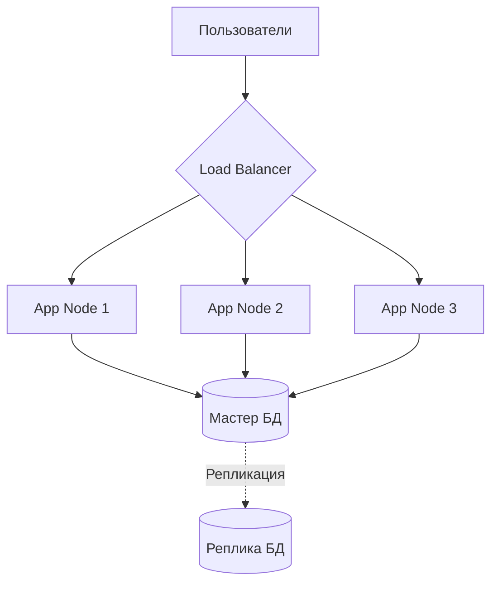

# Production Environment (Продакшен)

Production — это Святой Грааль, та самая среда, где живут ваши реальные пользователи и крутятся реальные деньги. Главная боль Production: страх релизов. Если деплой на прод вызывает дрожь в коленках и требует сбора всей команды в пятницу вечером — у вас проблемы с архитектурой.

Продакшен должен быть неизменяемым (Immutable). Вы не должны заходить на сервер по SSH, чтобы "быстренько поправить конфиг". Любое изменение должно проходить через Git и CI/CD.



**Неочевидные нюансы:**
- **Zero Trust:** Доступ к проду должен быть закрыт по умолчанию. Логи и метрики должны экспортироваться в централизованные системы (Datadog, Kibana), чтобы разработчикам не нужно было лазить на сервера.
- **Graceful Degradation:** Продакшен обязан уметь выживать при падении смежных сервисов (отвалился Redis — продолжаем работу медленнее, но не падаем с 500-й ошибкой).

**Антипаттерн:**
```bash
# Ручная правка кода на боевом сервере
ssh user@prod-server
nano /var/www/app/config.js
pm2 restart all # И никто в команде не знает об этом изменении
```

**Правильно:**
Тотальная автоматизация и Infrastructure as Code. Если сервер падает, Autoscaling Group просто убивает его и поднимает новый из свежего чистого образа.
