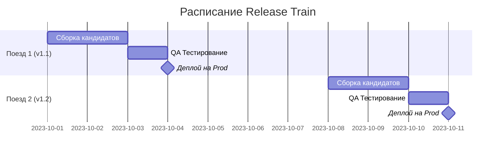

# Release Trains (Релизные поезда)

Release Train — это подход к расписанию релизов, позаимствованный из расписания реальных поездов. Поезд (релиз) отправляется строго по графику (например, каждый вторник и четверг в 10:00). 

Боль, которую мы решаем: хаос слияния веток. Когда каждая команда пытается выкатить свою фичу отдельно, возникают конфликты блокировок на staging. С Release Train правило простое: если твоя фича влита в `main` до 10:00 — она уезжает на прод. Не успел? Жди следующий поезд в четверг. Поезд никого не ждет.



**Скрытые трейдоффы и оверхед:**
Главное требование для "Поездов" — повсеместное использование **Feature Toggles (Флагов фич)**. Что если разработчик успел влить код, но фича бажная? Мы не отменяем весь поезд из-за него. Мы просто выключаем этот функционал флагом конфигурации (Feature Toggle) прямо на проде.

**Антипаттерн:**
Задерживать релиз всей компании на три дня, потому что "Вася дописывает валидацию формы".

**Правильное решение:**
```javascript
// Код выезжает на прод неактивным. Включается в админке, когда будет готов.
if (featureFlags.isEnabled('new_checkout_v2')) {
  renderNewCheckout();
} else {
  renderOldCheckout();
}
```
