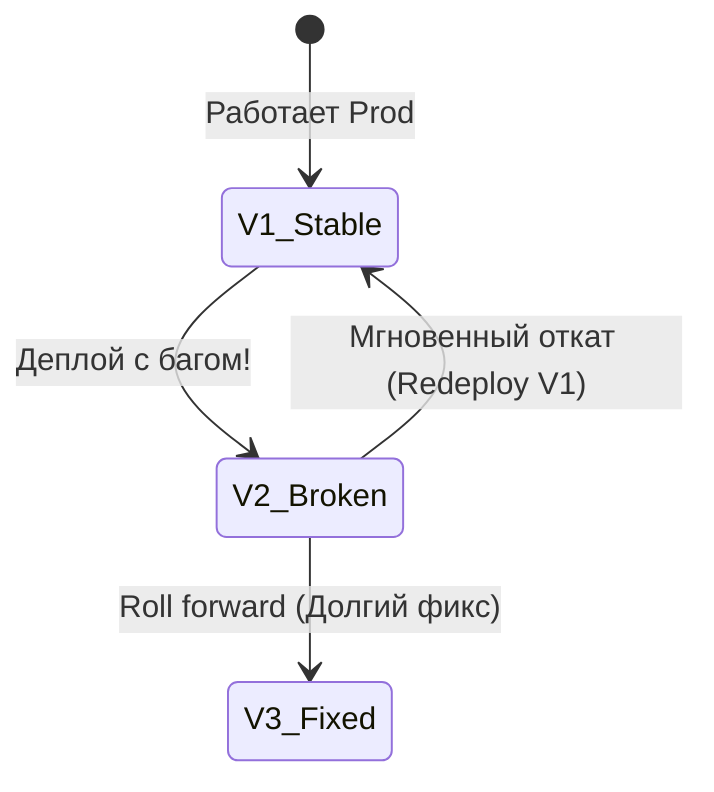

# Стратегия отката (Rollback Strategy)

Даже при идеальном тестировании на продакшен проникают баги. Боль начинается, когда баг критический (например, не работает оплата), а исправление займет часы. Rollback Strategy — это ваш "план Б", кнопка паники, позволяющая вернуть всё как было за пару минут.

Есть три основных подхода к откату:
1. **Redeploy old artifact (Откат артефакта):** Самый быстрый путь. CI не собирает код заново, а берет предыдущий стабильный Docker-образ и деплоит его.
2. **Revert commit:** Вы делаете `git revert`, создавая новый коммит, отменяющий сломанный. Пайплайн запускается заново. Это дольше, но сохраняет линейную историю.
3. **Roll forward:** Вы быстро пишете фикс и деплоите новую версию. Подходит только если баг некритичный.

**Скрытые трейдоффы и оверхед:**
Главный враг любого Rollback — **база данных**. Если релиз V2 включал удаление колонки из таблицы, откат кода на V1 мгновенно сломает приложение (V1 ожидает колонку, которой уже нет).
*Правило безопасного деплоя:* Сначала деплоим изменения схемы БД (добавление новых полей), убеждаемся что всё работает, затем деплоим код. Удаляем старые поля только в следующем релизе.

**Антипаттерн:**
Искать сломанный коммит и править его через `git push -f` прямо в ветке `main` под крики менеджера.
