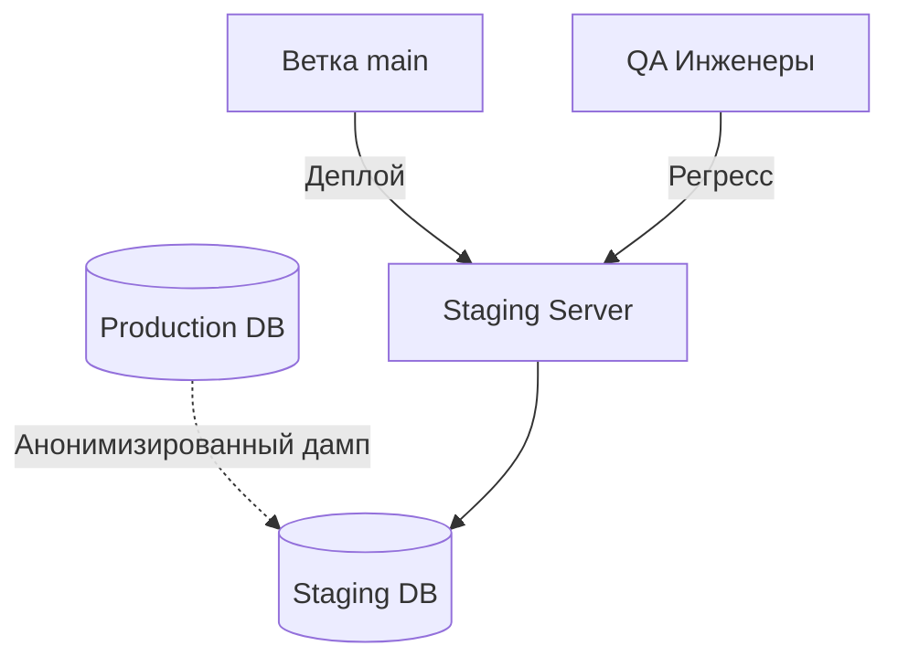

# Staging Environment (Предпродакшен)

Staging — это генеральная репетиция перед выходом на сцену (Production). Его главная задача: дать уверенность, что код, который отлично работал у разработчика, не развалится в реальных боевых условиях.

Чтобы Staging выполнял свою функцию, он должен быть **максимально точной копией Production**. Те же балансировщики, та же ОС, те же версии баз данных. Главная боль — это "загнивание" стейджинга. Со временем он обрастает мусорными тестовыми данными, ручными правками и перестает отражать реальность.



**Неочевидные нюансы:**
- **Фейковые интеграции:** Если ваше приложение отправляет SMS клиентам, Staging *не должен* отправлять реальные SMS. Вы обязаны использовать моки (Mock-серверы) для сторонних API, иначе сожжете бюджет.
- **Данные:** Тестировать на пустой базе бессмысленно. На стейджинге нужны реальные объемы данных, но они должны быть **анонимизированы** (GDPR, безопасность).

**Антипаттерн:**
```bash
# Использование слабой машины для стейджинга "ради экономии"
# В итоге вы не сможете поймать баги производительности и утечки памяти.
```

**Правильное решение:**
Использовать IaC (Terraform), чтобы описать инфраструктуру один раз и поднимать Staging/Prod из одного и того же кода, меняя только переменные (размеры дисков/CPU).
