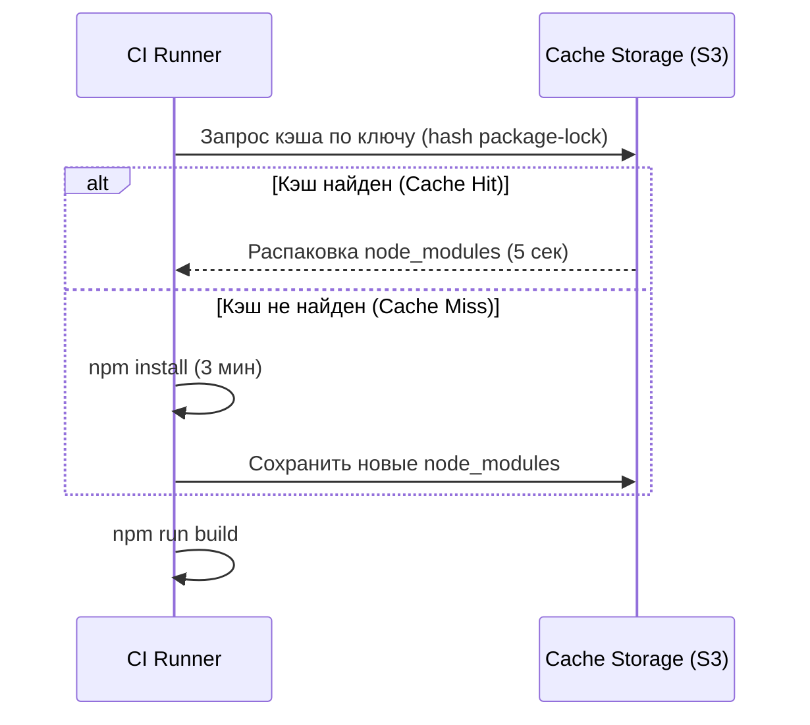

# Кеширование сборки (Build Cache)

Когда вы запускаете CI pipeline, он стартует на абсолютно пустой виртуальной машине. Это значит, что для каждого коммита вам нужно заново скачивать сотни мегабайт `node_modules` и компилировать весь проект. Боль: разработчики сидят по 15 минут в ожидании зеленой галочки.

Build Cache решает эту проблему, сохраняя тяжелые директории между запусками пайплайна. Если `package-lock.json` не изменился, CI просто распакует архив с готовыми `node_modules` за 5 секунд.



**Скрытые трейдоффы и оверхед:**
Кеширование — это классическая проблема программирования (Cache Invalidation). Если кэш испортился или ключ подобран неверно, вы получите "зеленый" билд, который сломан, или "красный", который локально собирается отлично.
Кешировать нужно не только пакеты, но и артефакты бандлеров (например, `.next/cache` или `node_modules/.cache/webpack`), что ускоряет саму сборку в разы.

**Пример (GitHub Actions):**
```yaml
# Правильное использование кэша: ключ зависит от lock-файла
- uses: actions/cache@v3
  with:
    path: ~/.npm
    key: ${{ runner.os }}-node-${{ hashFiles('**/package-lock.json') }}
    restore-keys: |
      ${{ runner.os }}-node-
```
