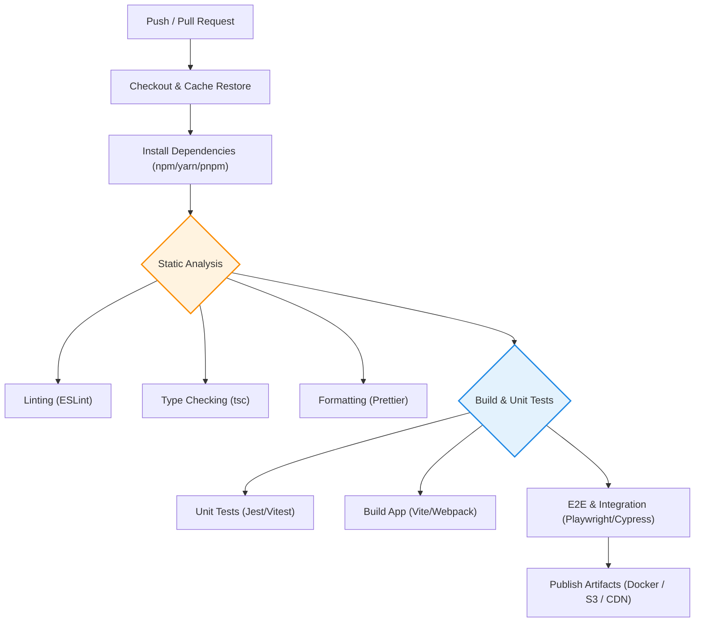

Непрерывная интеграция (Continuous Integration, CI) — это инженерная практика, при которой разработчики регулярно сливают изменения кода в центральный репозиторий, после чего автоматически запускаются процессы сборки и тестирования. Главная цель CI — как можно раньше обнаружить конфликты интеграции и регрессионные ошибки, не давая "сломанному" коду попасть в основную ветку (`main` / `master`).

---

## 1. Архитектура CI-пайплайна (Frontend)

Современный фронтенд-пайплайн строится по принципу "fail-fast": сначала выполняются самые быстрые и дешевые проверки (линтеры, форматирование), а ресурсоемкие (сборка, E2E тесты) откладываются на конец.



### 1.1. Основные концепции (Quality Gates)
Каждый этап пайплайна является "Quality Gate" (вратами качества). Если этап падает — весь процесс останавливается.
* **Изоляция:** Каждая джоба должна выполняться в изолированном, воспроизводимом окружении (Docker-контейнеры, чистые агенты).
* **Идемпотентность:** Повторный запуск того же коммита должен давать идентичный результат.
* **Скорость:** Идеальный CI пайплайн отрабатывает быстрее 10 минут. Если он идет дольше, разработчики теряют контекст, ожидая результатов.

---

## 2. Оптимизация пайплайна: Кэширование (Build Cache)

Установка зависимостей (`npm install`) — одна из самых долгих стадий. Использование CI-кэша кардинально решает эту боль.

### Антипаттерн: Установка зависимостей с нуля
```yaml
# Плохо: npm install каждый раз скачивает мегабайты из интернета
steps:
  - run: npm install
```

### Как надо: Кэширование по Lock-файлу
Мы кэшируем директорию `.npm` или `node_modules` с ключом, основанным на хэше `package-lock.json`. Если `package-lock.json` не изменился, мы берем папку из кэша.

```yaml
# Пример GitHub Actions (Как надо)
steps:
  - name: Setup Node.js
    uses: actions/setup-node@v3
    with:
      node-version: '18'
      cache: 'npm' # Автоматически кэширует ~/.npm

  - name: Install dependencies
    run: npm ci # Строго по lock-файлу, удаляя старый node_modules
```
*Примечание:* Использование `npm ci` вместо `npm install` обязательно в CI, так как `npm install` может неявно обновить версии и перезаписать `package-lock.json`, нарушив идемпотентность.

---

## 3. Неочевидные нюансы и Трейдоффы

### 3.1. Кэширование vs. Воспроизводимость ("Грязный кэш")
* **Боль:** Слишком агрессивное кэширование (особенно кэширование папок сборки, таких как `.next` или `node_modules` целиком) может привести к тому, что локально сборка падает, а в CI проходит (или наоборот).
* **Трейдофф:** Мы жертвуем абсолютной гарантией чистоты ради скорости. 
* **Правило:** Кэш зависимостей и кэш сборки должны инвалидироваться при изменении lock-файла. Раз в сутки (или при деплое в Production) полезно запускать пайплайн вообще без кэша для финальной валидации.

### 3.2. Параллелизация против Стоимости
Разделение юнит-тестов и сборки на параллельные джобы ускоряет CI.
* **Трейдофф:** Каждая параллельная джоба заново скачивает код и зависимости. В облачных CI (GitHub Actions, GitLab SaaS) вы платите за минуты. Распараллеливание на 3 джобы может ускорить процесс в 2 раза, но увеличить биллинг в 3 раза.
