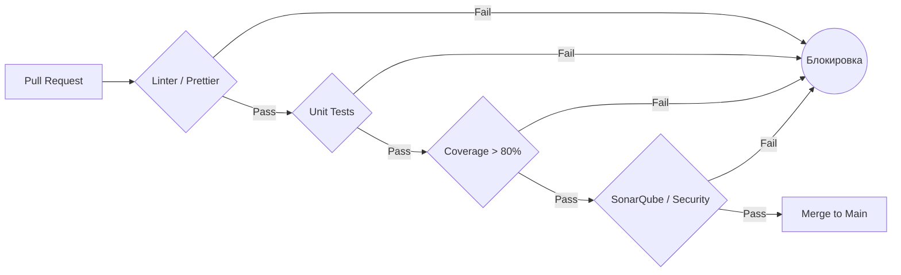

# Врата качества (Quality Gates)

Quality Gates — это автоматизированные охранники вашего репозитория. Это набор строгих проверок в CI, которые блокируют слияние Pull Request (или деплой), если код не соответствует стандартам команды.

Какую боль решаем: без ворот качества разработчики неизбежно будут коммитить код, не прошедший тесты, с ошибками линтера или с уязвимостями. Quality Gates убирают человеческий фактор. Код плохой? Кнопка "Merge" просто горит серым.

**Неочевидные нюансы:**
- **Flaky Tests (Мигающие тесты):** Если тесты падают случайным образом из-за таймаутов сети, ворота качества превращаются в пытку. Разработчики начинают игнорировать ошибки и просто перезапускать CI до победного.
- **Баланс строгости:** Слишком жесткие правила (например, покрытие тестами строго 100%) убивают скорость разработки и заставляют писать бессмысленные тесты ради тестов.

**Антипаттерн:**
Запускать линтер и тесты, видеть, что они упали, но разрешать слияние ветки, потому что "срочно надо на прод".

**Правильное решение (Конфигурация репозитория):**
В настройках GitHub / GitLab необходимо включить `Require status checks to pass before merging`. Тогда обойти пайплайн будет технически невозможно.
