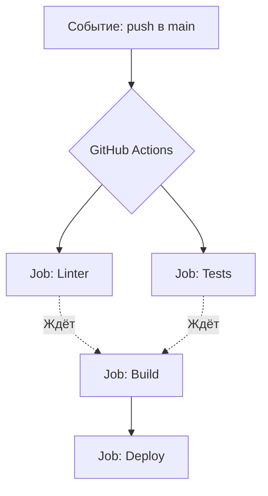

# GitHub Actions

До появления GitHub Actions разработчикам приходилось поднимать и обслуживать отдельные серверы (например, Jenkins или TeamCity), чтобы просто запустить линтер. Боль: настройка CI была задачей отдельного DevOps-инженера. 

GitHub Actions перевернул игру, интегрировав CI прямо в репозиторий. Теперь пайплайн — это просто YAML-файл в папке `.github/workflows`. Главная киллер-фича — **Marketplace экшенов**. Вместо того чтобы писать скрипт деплоя на AWS, вы просто берете готовый `aws-actions/configure-aws-credentials`.



**Неочевидные нюансы:**
- **Vendor Lock-in:** Ваш пайплайн на 100% привязан к синтаксису GitHub. Переехать на GitLab CI будет больно.
- **Локальное тестирование:** Дебажить YAML-файлы вслепую, делая коммиты вроде "fix ci", "fix ci 2", "pls work" — это классика. Для локального запуска приходится использовать сторонние костыли вроде утилиты `act`.

**Антипаттерн:**
Писать всю логику пайплайна Bash-скриптами внутри YAML:
```yaml
- run: |
    if [ "$ENV" = "prod" ]; then
      # 50 строк bash-лапши
    fi
```

**Правильное решение:**
Использовать готовые Actions или выносить сложную логику в отдельные Node.js / Python скрипты в вашем репозитории.
