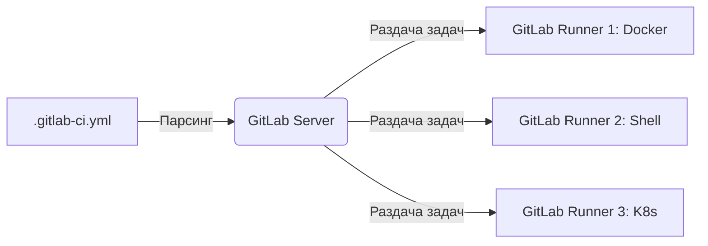

# GitLab CI

Если GitHub Actions — это набор кубиков Lego, то GitLab CI — это заводской конвейер, поставляемый "из коробки". Исторически GitLab первым сделал CI/CD интегрированным прямо в интерфейс репозитория.

Боль, которую мы решаем: зоопарк инструментов. Когда у вас код в Bitbucket, CI в Jenkins, а Docker-образы в Nexus — всё это ломается на стыках. GitLab предоставляет "Всё-в-одном": репозиторий, пайплайны, Container Registry и даже Security сканеры в едином YAML-файле `.gitlab-ci.yml`.



**Скрытые трейдоффы и оверхед:**
Главная мощь (и боль) GitLab CI — это **Runners** (агенты сборки). В отличие от GitHub, где облачные раннеры даются по умолчанию, в серьезных проектах на GitLab вам придется поднимать собственные сервера для раннеров, настраивать их кэширование и следить за тем, чтобы на них не закончилось место (особенно от Docker-образов).

**Пример (Умное кэширование зависимостей):**
```yaml
# Кэш сохраняется между джобами для ускорения
cache:
  key:
    files:
      - package-lock.json
  paths:
    - .npm/

build:
  stage: build
  script:
    - npm ci --cache .npm --prefer-offline
    - npm run build
```
