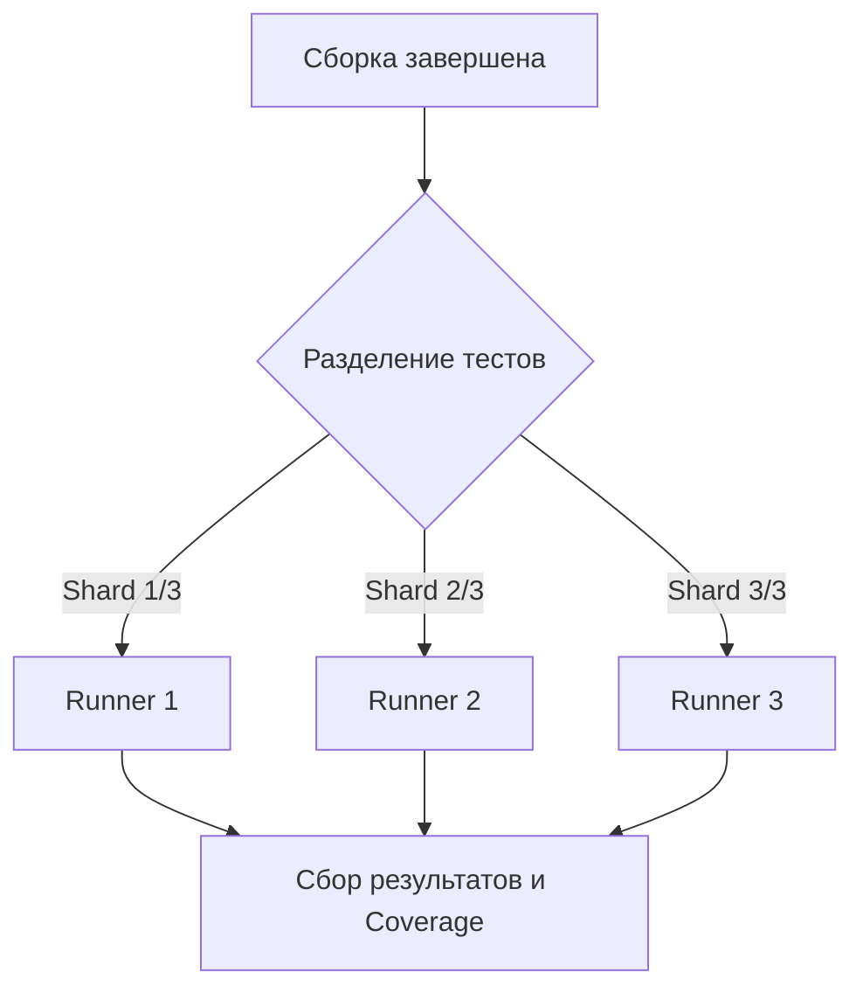

# Параллелизация (Parallelization)

С ростом проекта CI/CD пайплайны неизбежно становятся медленными. Когда у вас 5000 юнит-тестов и 200 E2E-тестов на Playwright, последовательный запуск займет час. Боль: разработчик отправляет PR и идет пить кофе, теряя контекст задачи.

Параллелизация решает эту проблему деньгами: мы арендуем не одну машину на 60 минут, а 10 машин на 6 минут. Пайплайн разделяет тесты на батчи (shards) и запускает их одновременно на разных раннерах (воркерах).



**Неочевидные нюансы:**
- **Цена:** Платить за параллельные минуты в облаке дорого.
- **Состояние базы данных:** Если ваши параллельные тесты пишут в одну и ту же тестовую базу данных, они будут лочить таблицы друг другу и падать со случайными ошибками (Flaky tests). Каждый параллельный воркер должен иметь свою изолированную БД (например, в Docker-контейнере) или работать с уникальными ID сущностей.

**Пример конфигурации (Playwright Sharding в GitHub Actions):**
```yaml
strategy:
  matrix:
    shard: [1, 2, 3, 4]
steps:
  - name: Run Playwright tests
    run: npx playwright test --shard=${{ matrix.shard }}/4
```
