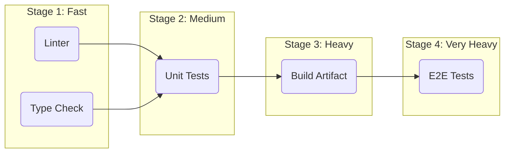

# Стадии пайплайна (Pipeline Stages)

Если запустить все проверки одновременно, пайплайн превратится в хаос. Если запустить всё последовательно — он будет идти вечность. Иерархия стадий пайплайна решает проблему баланса между скоростью обратной связи и стоимостью вычислений.

Главное правило: **Fast Fail (Падай быстро)**. Вы не должны ждать 15 минут сборки Webpack, чтобы узнать, что забыли точку с запятой. Самые быстрые и дешевые проверки должны выполняться первыми.

Типичная архитектура стадий (DAG - Directed Acyclic Graph):
1. **Lint & Format:** Идет 10 секунд. Отсеивает синтаксический мусор.
2. **Unit Tests:** Идет 2 минуты. Отсеивает сломанную бизнес-логику.
3. **Build:** Идет 5 минут. Собирает артефакт. Только если прошли тесты.
4. **E2E Tests:** Идет 10 минут. Выполняется *против собранного артефакта*.
5. **Deploy:** Завершающий этап.

**Антипаттерн:**
Запускать E2E тесты параллельно со сборкой билда, используя "какой-то старый билд с ветки main", потому что "так быстрее".

**Правильное решение:**
Строгие зависимости между джобами (`needs` в GitHub Actions). Джоба Build не начнется, пока Linter и Type Check не дадут зеленый свет.
