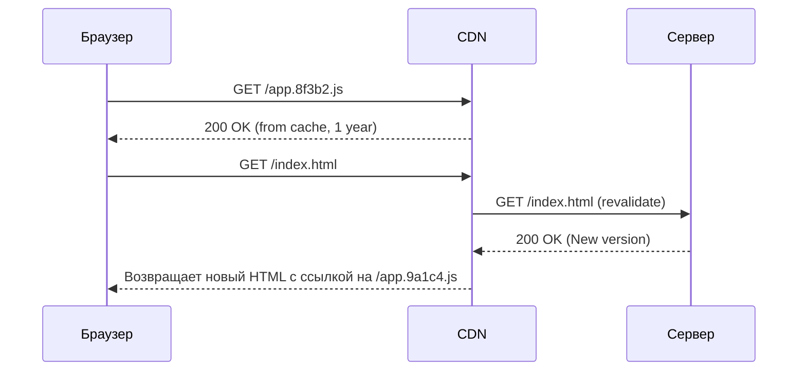

# Инвалидация кэша (Cache Invalidation)

В программировании есть две главные проблемы: инвалидация кэша, именование переменных и ошибки на единицу. В мире фронтенда инвалидация кэша — это боль, когда вы выкатываете критичный фикс, а половина пользователей всё ещё видит старую версию сайта.

Браузеры и CDN агрессивно кэшируют статику, чтобы экономить трафик. Если вы просто замените `style.css` на сервере, браузер об этом не узнает. Решение кроется в умной стратегии Cache-Control и хешировании имен файлов (Fingerprinting).

**Неочевидные нюансы:**
- Никогда не кэшируйте `index.html`. Для него всегда должен стоять заголовок `Cache-Control: no-cache`. Это точка входа, которая скажет браузеру скачать новые хешированные JS/CSS файлы.
- Хешированные файлы (например `main.a2b3c.js`) нужно кэшировать навсегда (`Cache-Control: max-age=31536000, immutable`).

**Антипаттерн:**
Использовать query-параметры для инвалидации: `script.js?v=1.2`. Некоторые агрессивные прокси-серверы и старые CDN игнорируют параметры и отдадут старый файл.

**Правильное решение:**
Внедрять хеш содержимого прямо в имя файла с помощью Webpack/Vite (Content Hash).
