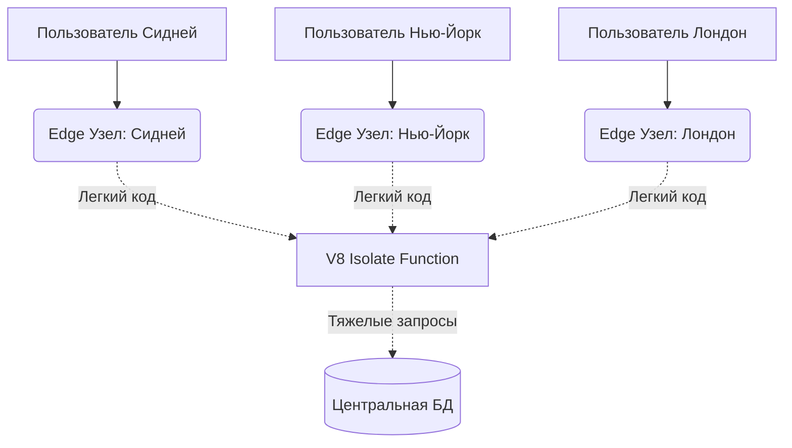

# Edge Computing (Вычисления на краю сети)

Традиционный бекенд живет в одном дата-центре (например, во Франкфурте). Если ваш пользователь из Австралии, каждый его запрос летит через половину земного шара, добавляя 300мс пинга просто на физику света в оптоволокне. 

Edge Computing решает эту боль, перенося вычисления из центрального сервера на "край" сети (CDN узлы). С помощью Edge Functions (Cloudflare Workers, Vercel Edge) ваш код запускается прямо в дата-центре провайдера, ближайшем к пользователю, в радиусе 10 километров от его дома.

**Скрытые трейдоффы и оверхед:**
- **Ограниченная среда:** Edge функции не работают в полноценном Node.js. Они крутятся в V8 Isolates. Вы не можете использовать привычные модули вроде `fs` (файловая система) или тяжелые npm-пакеты.
- **База данных:** Если ваша Edge-функция в Сиднее делает запрос к центральной базе во Франкфурте, вы теряете весь смысл Edge (пинги возвращаются). Edge требует глобально реплицируемых БД (Turso, DynamoDB Global Tables).

**Где применимо:**
Идеально для A/B тестирования (роутинг), проверки JWT токенов, модификации заголовков на лету, отдачи статики и Server-Side Rendering'а легких страниц.
