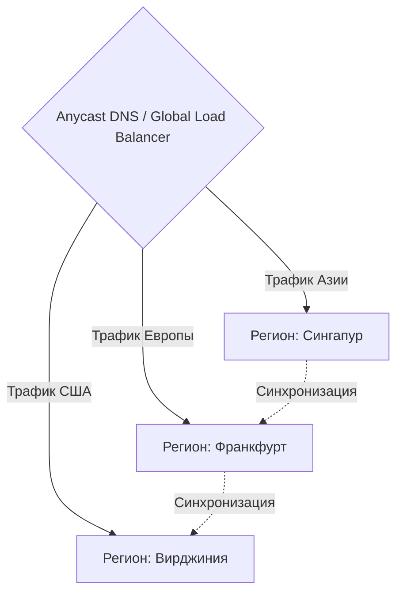

# Мультирегиональная доставка (Multi-Region)

Размещение вашего приложения в одном дата-центре (например, `us-east-1` в AWS) — это бомба замедленного действия. Боль: когда экскаватор перерубает кабель дата-центра, ваш бизнес останавливается. Мультирегиональная архитектура решает проблему отказоустойчивости (High Availability) и задержек.

Сайт разворачивается сразу в 3-5 регионах по всему миру. Технология Anycast маршрутизирует пользователя на ближайший к нему сервер. Если целый регион "ложится", трафик бесшовно перетекает в соседний.

**Неочевидные нюансы:**
- **CAP-теорема бьет больно:** Распределить статический фронтенд по миру легко. Но распределить базу данных, сохранив консистентность, невероятно сложно. Часто фронтенд делается Multi-Region, а база остается Single-Region с Read-репликами.
- **Оверхед на CI/CD:** Деплой должен проходить последовательно (Rolling Update) по регионам. Если вы выкатите баг одновременно везде, то убьете всю отказоустойчивость.

**Антипаттерн:**
Использовать DNS Round Robin (перебор IP адресов) для балансировки регионов. DNS кэшируется, и если один сервер упадет, пользователи еще часы будут ходить на "мертвый" IP. Нужно использовать умные балансировщики (Global Accelerator).
