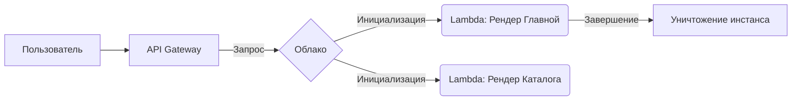

# Бессерверный хостинг (Serverless)

Исторически вы арендовали виртуальный сервер, настраивали Nginx, Node.js и платили за сервер 24/7, даже если ночью к вам никто не заходил. Serverless кардинально меняет парадигму: вы загружаете только код (функцию), а облако само поднимает сервер при поступлении запроса и убивает его, когда запрос обработан. Вы платите строго за миллисекунды работы кода.

Это идеальное решение для фронтенд-фреймворков с SSR (Next.js, Nuxt), где каждая страница может рендериться своей собственной Lambda-функцией.



**Скрытые трейдоффы и оверхед:**
Главная проблема Serverless — **Cold Starts (Холодные старты)**. Если вашу функцию никто не вызывал 15 минут, облако выгружает её из памяти. Следующий пользователь, который обратится к сайту, будет ждать 1-3 секунды, пока поднимется контейнер, загрузится Node.js и инициализируется фреймворк.

**Антипаттерн:**
Создавать тяжелые подключения к базе данных внутри самой функции.
```javascript
// Плохо: при каждом вызове (и холодном старте) создается новый пул коннектов
export const handler = async () => {
    const db = await connectToDb(); // Убьет БД тысячами коннектов
    return db.query(...);
}
```

**Правильное решение:**
Использовать Data API (HTTP), Serverless-базы данных (Neon, PlanetScale) или инициализировать подключение *вне* хендлера.
