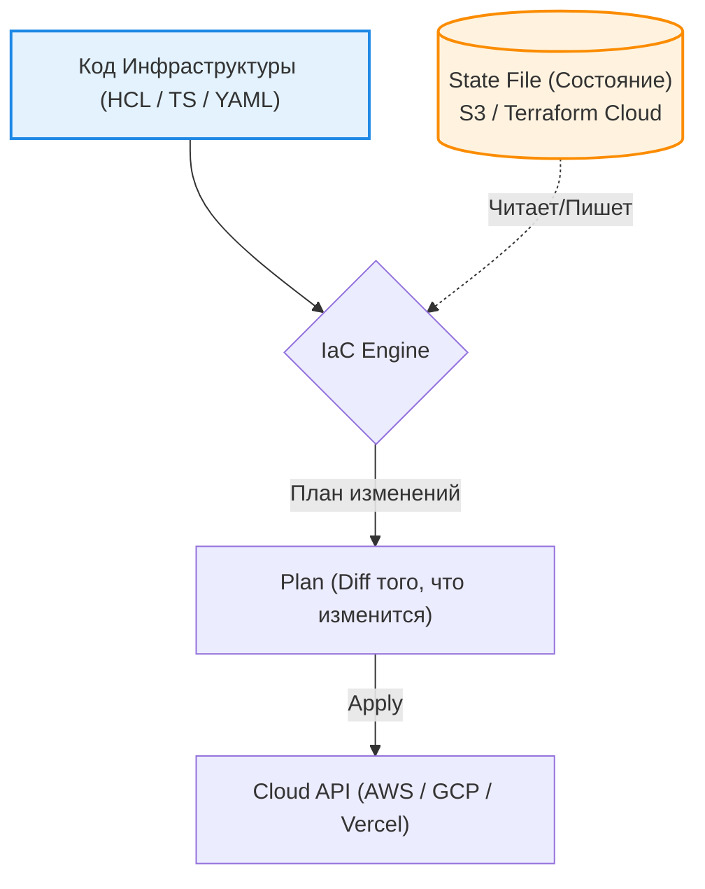

Infrastructure as Code (IaC) — это подход к управлению и описанию инфраструктуры (серверов, баз данных, CDN, балансировщиков) через конфигурационные файлы и код, а не через ручное прокликивание кнопок в веб-интерфейсе облачных провайдеров (AWS, GCP, Azure).

---

## 1. Зачем фронтендеру IaC?

Исторически инфраструктурой занимались DevOps-инженеры. Однако в эпоху Serverless (Vercel, Netlify, AWS Lambda) и микрофронтендов граница между кодом приложения и инфраструктурой стирается. Фронтенд-команда должна уметь описать свои зависимости (S3 бакет, CloudFront дистрибуцию, DNS записи) рядом с кодом.

### Боль, которую мы решаем: "Snowflake Servers"
Если инфраструктура настраивается руками, сервер становится уникальным, как снежинка (Snowflake). Никто не знает, какие галочки нажаты в консоли AWS. Если сервер падает, восстановить его — это часы ручной работы.

**Решение IaC:** Инфраструктура декларативна и версионируется в Git. Поднять копию Production для нагрузочного тестирования — это одна команда в терминале.

---

## 2. Архитектура и инструменты

Существует два основных подхода к IaC: Декларативный (YAML/HCL) и Императивный (Языки программирования).



### 2.1. Декларативный подход: Terraform
Золотой стандарт индустрии. Описывает *конечный результат* с помощью языка HCL (HashiCorp Configuration Language).

*Пример: Создание S3 бакета для статики SPA*
```hcl
resource "aws_s3_bucket" "frontend_app" {
  bucket = "my-company-frontend-prod"
}

resource "aws_s3_bucket_public_access_block" "public_access" {
  bucket = aws_s3_bucket.frontend_app.id
  block_public_acls       = false
  block_public_policy     = false
}
```

### 2.2. Императивный подход (Инфраструктура как настоящий код): Pulumi / AWS CDK
Вместо HCL используется TypeScript/Python/Go.
**Где применимо:** Идеально для фронтендеров, так как можно писать инфраструктуру на знакомом TypeScript, переиспользовать интерфейсы, писать циклы и юнит-тесты.

```typescript
// Пример Pulumi (TypeScript)
import * as aws from "@pulumi/aws";

// Создаем бакет
const siteBucket = new aws.s3.Bucket("frontend-site");

// Экспортируем URL сайта
export const bucketName = siteBucket.id;
```

---

## 3. Ключевая концепция: Управление состоянием (State)

Самая важная деталь IaC — это **State (Состояние)**.
Инструменты (Terraform/Pulumi) не просто создают ресурсы в облаке. Они хранят карту связей между вашим кодом и реальными идентификаторами ресурсов в облаке (в `.tfstate` файле).
* Когда вы удаляете строчку кода с ресурсом, Terraform смотрит в State, понимает, что этот ресурс был создан им, и вызывает API облака для его удаления.
* **Где ломается:** Если State-файл будет удален, или если кто-то поменяет настройки руками через AWS Console, произойдет "Drift" (рассинхронизация). Terraform при следующем запуске попытается "починить" облако, вернув его к состоянию из кода, что может привести к удалению ручных изменений.

---

## 4. Трейдоффы и границы применимости

* **Оверхед для малых проектов:** Если вы делаете MVP или лендинг, поднимать Terraform слишком дорого. Проще использовать Vercel/Netlify, где инфраструктура неявно управляется самим провайдером.
* **Разделение ответственности:** В крупных компаниях фронтендеры могут писать IaC, но применять его (Apply) имеют право только CI/CD пайплайны с аппрувом от DevOps или Security команды, чтобы избежать случайного открытия доступов (например, сделать бакет с персональными данными публичным).
* **Секреты:** Никогда не храните пароли или API-ключи прямо в коде IaC. Они должны инжектироваться из защищенных хранилищ (HashiCorp Vault, AWS Secrets Manager) во время выполнения (Runtime) или развертывания.
