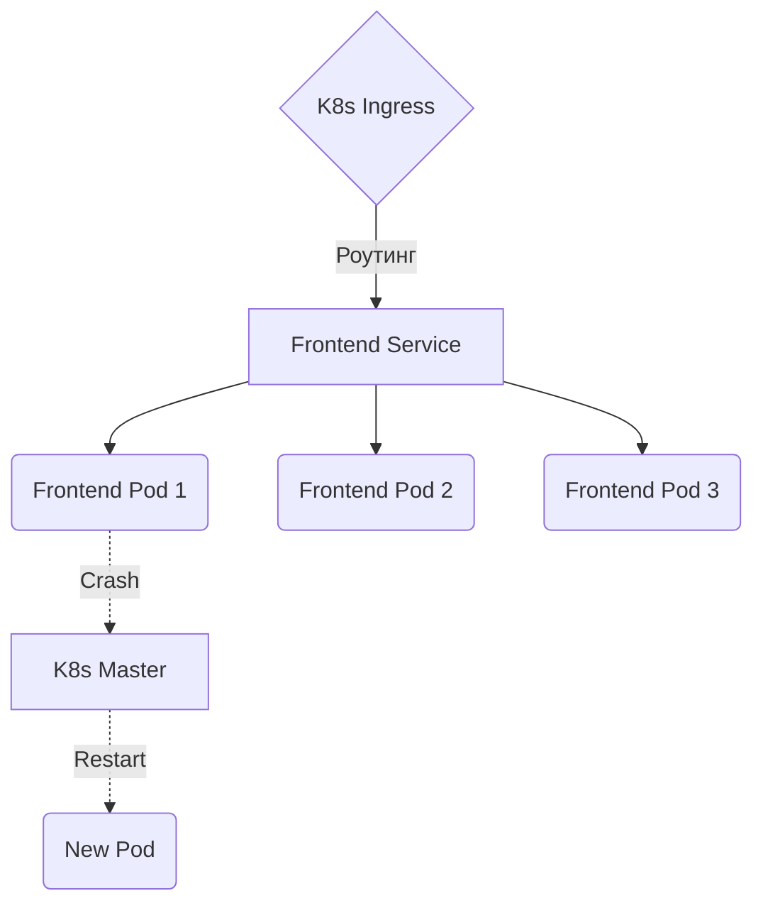

# Kubernetes для Frontend

Kubernetes (K8s) — это индустриальный стандарт для оркестрации контейнеров. Но нужен ли он для фронтенда? Боль, которую решает K8s — это управление тысячами серверов, автоматическое масштабирование и самовосстановление (Self-healing).

Если ваш бекенд уже живет в K8s, логично поместить туда и фронтенд. Обычно приложение собирается (React -> статика), кладется внутрь легкого Docker-контейнера с Nginx, и деплоится как Pod.

**Скрытые трейдоффы и оверхед:**
- **Overkill:** Использовать K8s *только* для фронтенда — это как купить экскаватор, чтобы посадить цветок. Это невероятно сложно в настройке и поддержке.
- **Холодные старты подов:** В отличие от Serverless, масштабирование подов занимает время (минуты), поэтому при резком наплыве трафика K8s может не успеть отреагировать.

**Антипаттерн:**
Создавать микрофронтенды, где каждый компонент (шапка, футер) это отдельный Pod в K8s, собираемый через Server-Side Includes в Ingress. Это приведет к аду отладки.
