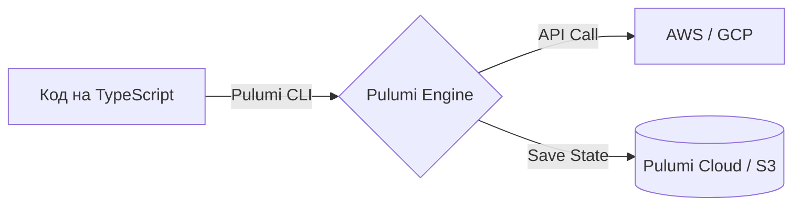

# Pulumi

Pulumi — это современный ответ Terraform. Главная боль классического IaC (Infrastructure as Code) в том, что вам приходится учить специфичные декларативные языки вроде HCL (HashiCorp Configuration Language), в которых сложно написать банальный цикл `for` или `if-else`.

Pulumi позволяет описывать инфраструктуру на настоящих языках программирования: TypeScript, Python, Go. 



**Неочевидные нюансы:**
- **Тестируемость:** Поскольку инфраструктура описана на TypeScript, вы можете писать к ней обычные Unit-тесты с помощью Jest. Например, тест проверит, что ни один S3 bucket не создается публично доступным.
- **Императивность vs Декларативность:** Писать IaC на JS заманчиво, но легко скатиться в императивную лапшу. Важно помнить, что код должен лишь *описывать желаемое состояние*, а не диктовать *как* его достичь.

**Пример (TypeScript):**
```typescript
import * as aws from "@pulumi/aws";

// Создание S3 корзины и раздача статического сайта одной командой
const siteBucket = new aws.s3.Bucket("my-frontend", {
    website: { indexDocument: "index.html" },
});
```
