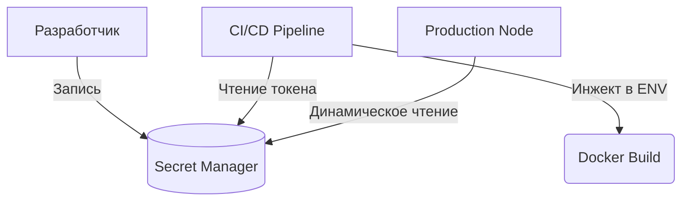

# Управление секретами (Secrets Management)

Секреты — это API-ключи, пароли к базам данных и токены доступа. Главная боль безопасности: как передать секрет приложению, чтобы его никто не украл. 

Худшее, что можно сделать — закоммитить ключ в репозиторий. Как только токен попадает в Git, он считается скомпрометированным. Правильный подход — хранить секреты в специализированных сервисах (HashiCorp Vault, AWS Secrets Manager, GitHub Secrets) и инжектить их только в момент сборки или рантайма.



**Скрытые трейдоффы и оверхед:**
- **Build-time vs Run-time:** Если вшить секрет на этапе сборки фронтенда (React/Vue), он попадет в итоговый JS-бандл и **будет виден всем пользователям** в DevTools браузера. Во фронтенде можно безопасно хранить только публичные ключи (например, Stripe Public Key или Sentry DSN).
- **Приватные секреты:** Любые настоящие пароли (к БД, к приватным API) должны жить только на бэкенде.

**Антипаттерн:**
```javascript
// Никогда не делайте так во фронтенд-коде
const STRIPE_SECRET_KEY = process.env.STRIPE_SECRET_KEY; // Утечет в бандл!
```

**Правильное решение:**
Использовать префиксы (например, `NEXT_PUBLIC_` в Next.js или `VITE_` в Vite), которые четко разделяют: какие переменные можно вшивать в публичный фронтенд, а какие должны остаться только на сервере.
