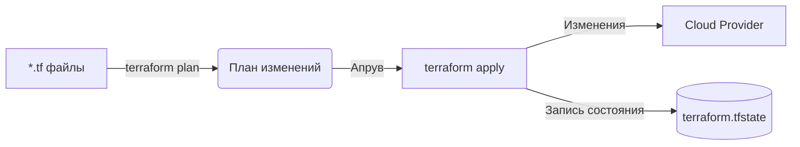

# Terraform

Terraform — это абсолютный индустриальный стандарт в мире Infrastructure as Code (IaC). До его появления инфраструктуру настраивали руками в консоли AWS. Боль: если администратор уволился, никто не знает, почему эта галочка стоит именно здесь, и как поднять копию сервера.

Terraform позволяет описать серверы, базы данных, сети и DNS-записи в виде декларативного кода на языке HCL. Вы пишите "Хочу S3 Bucket и CDN", запускаете `terraform apply`, и Terraform сам решает, какие API-запросы нужно отправить провайдеру для создания этой архитектуры.



**Неочевидные нюансы:**
- **State File (Состояние):** Terraform хранит текущее состояние облака в файле `.tfstate`. Этот файл невероятно критичен. Если вы его потеряете — Terraform забудет о созданных серверах. Более того, в нем хранятся **пароли в открытом виде**. State файл должен лежать в зашифрованном S3 бакете.
- **Инфраструктурный дрифт:** Если кто-то зайдет в консоль AWS и поменяет настройки руками, при следующем `terraform apply` Terraform безжалостно затрет эти изменения, возвращая систему к коду.

**Пример конфигурации (HCL):**
```hcl
resource "aws_cloudfront_distribution" "cdn" {
  origin {
    domain_name = aws_s3_bucket.frontend.bucket_regional_domain_name
    origin_id   = "S3-frontend"
  }
  enabled             = true
  default_root_object = "index.html"
}
```
