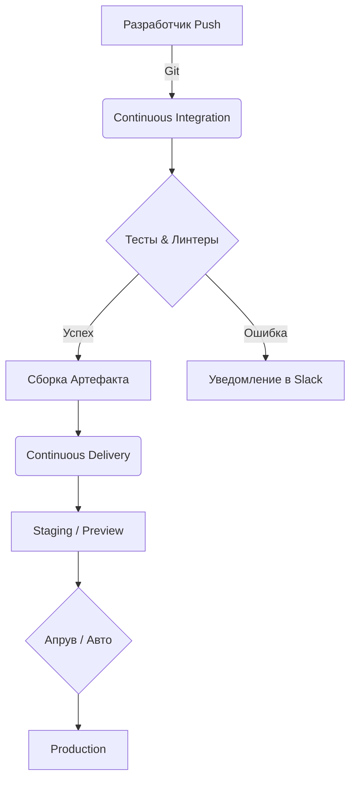

# CI/CD, Инфраструктура и Delivery

В современной фронтенд-разработке написать код — это только половина дела. Вторая половина — безопасно, быстро и надежно доставить этот код до конечного пользователя. В этом разделе мы решаем главную боль: как перестать деплоить руками по пятницам и молиться, чтобы ничего не упало.

Инфраструктура и пайплайны превращают процесс релиза из рулетки в предсказуемый и скучный конвейер. Мы стремимся к тому, чтобы любой разработчик мог влить свой код в `main`, и через несколько минут (или десятков минут) он автоматически оказался на проде, предварительно пройдя все круги тестов, сборок и проверок безопасности.



**Где это ломается:**
- **Чрезмерная автоматизация:** пайплайны, которые идут по 40 минут из-за E2E тестов, убивают продуктивность.
- **Инфраструктурный дрифт:** когда настройки серверов/CDN меняются руками в обход IaC (Infrastructure as Code).

**Антипаттерн:**
```bash
# Ручной деплой с локальной машины - верный путь к проблемам
npm run build
scp -r ./dist user@server:/var/www/html
```

**Правильно:**
Всё описано кодом (Pipeline as Code, Infrastructure as Code). Если сервер сгорит, вы должны быть способны поднять копию продакшена одной командой.
