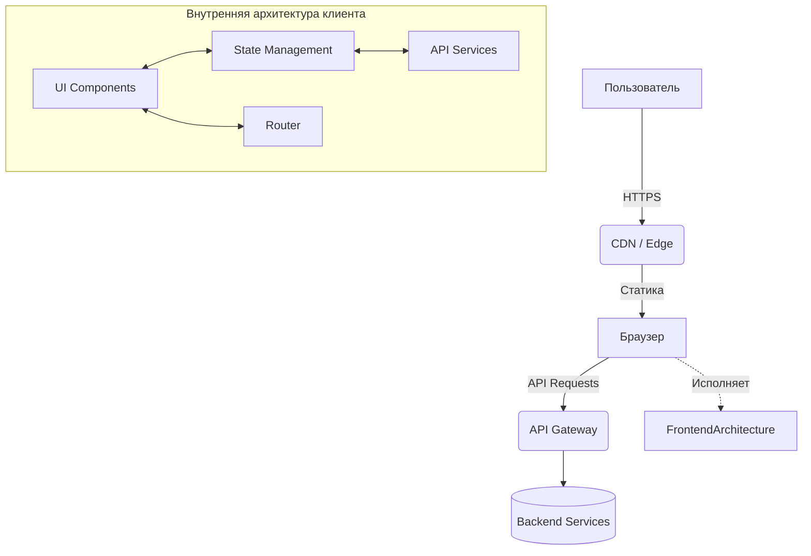

# System Design для Frontend

**System Design во Frontend-разработке** — это процесс проектирования архитектуры клиентского приложения с учётом требований бизнеса, ожидаемой нагрузки, ограничений сети и браузера, а также потребностей команды. Это не просто "как мы разложим файлы по папочкам" (хотя и это тоже), а масштабное видение того, как система будет жить, дышать и развиваться в течение следующих нескольких лет.

### Какую боль мы решаем?
Когда проект только стартует, кажется, что можно обойтись без сложного проектирования: взяли фреймворк, накидали компонентов — и в продакшен. Но со временем кодовая база разрастается, команда увеличивается, появляются новые нетривиальные требования (офлайн-режим, микрофронтенды, сложный стейт-менеджмент). Если фундаментальные решения не были продуманы заранее, проект превращается в "большой комок грязи" (Big Ball of Mud). Каждая новая фича ломает три старые, а онбординг нового разработчика занимает месяцы. 

System Design позволяет:
- **Предвидеть узкие горлышки** (bottlenecks) в производительности.
- **Определить границы модулей**, чтобы разные команды могли работать независимо.
- **Выбрать правильные инструменты** и обосновать этот выбор.

### Как это работает на практике

Проектирование начинается не с кода, а со сбора требований (функциональных и нефункциональных). Затем мы переходим к макро-архитектуре (как фронтенд общается с бэкендом, CDN, Edge-серверами), затем к микро-архитектуре (слои приложения, стейт-менеджмент) и, наконец, к документированию принятых решений.

### Неочевидные нюансы: скрытые трейдоффы

**System Design — это всегда про компромиссы.** Идеальных решений не существует.
1. **Архитектура vs Time-to-Market**: Слишком долгое проектирование ("паралич анализа") может убить проект до его запуска. Иногда нужно принять осознанный технический долг, чтобы быстрее проверить гипотезу.
2. **Оверхед (Overengineering)**: Внедрение микрофронтендов или сложной Clean Architecture в проект, который делает один разработчик за месяц — это антипаттерн. Архитектура должна соответствовать масштабу задачи.
3. **Границы применимости**: То, что отлично сработало для Spotify или Netflix, может похоронить стартап с 1000 DAU (Daily Active Users). Карго-культ в System Design — ваш злейший враг.

### Пример из жизни

**Антипаттерн**: «Мы будем использовать GraphQL, React, Redux Toolkit, WebSockets и микрофронтенды, потому что это современно». (А задача — сделать простую админку для 5 менеджеров).

**Правильное решение**: «Для MVP админ-панели мы берём React + React Query + REST API монолита. Это позволит нам запустить проект через месяц силами двух мидлов. Если нагрузка вырастет или появится сложный риал-тайм, мы выделим отдельный WebSocket-сервис, но сейчас нам это не нужно».
