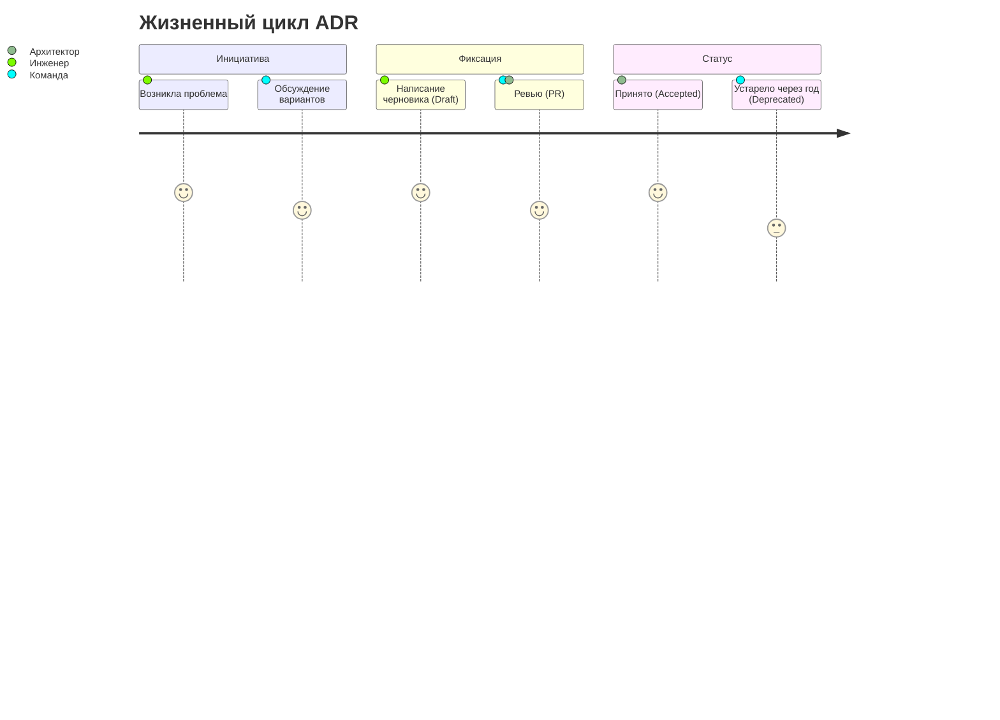

# Architecture Decision Records (ADR)

**Architecture Decision Record (ADR)** — это короткий текстовый документ, в котором фиксируется важное архитектурное решение, принятое командой, вместе с его контекстом и последствиями. Это ваш инженерный дневник, который объясняет *почему* система спроектирована именно так, а не иначе.

### Какую боль мы решаем?
Представьте ситуацию: вы приходите на проект и видите, что для управления состоянием используется некая самописная библиотека на RxJS, хотя весь мир давно использует Redux или Zustand. Вы спрашиваете коллег: "А почему так?". А они пожимают плечами: "Ну, это Вася три года назад внедрил, а потом уволился". Знакомо?

Без фиксации решений:
- Теряется контекст.
- Команда наступает на одни и те же грабли ("А давайте перепишем на GraphQL? Ой, мы же уже пробовали год назад и упёрлись в проблему N").
- Решения принимаются кулуарно (в курилке или в личке) и не транслируются на всю команду.

### Как это работает на практике

ADR хранятся прямо в репозитории (обычно в папке `docs/adr/`) в формате Markdown. Каждый файл имеет порядковый номер и чёткую структуру. Когда принимается важное решение (например, смена стейт-менеджера, выбор стратегии рендеринга SSR vs CSR, или выбор UI-кита), создаётся новый ADR.



### Структура ADR

Классический шаблон (Michael Nygard):
1. **Title** (Название и статус: Draft, Accepted, Deprecated).
2. **Context** (Что происходит, в чём проблема, какие силы на нас действуют).
3. **Decision** (Что мы решили сделать).
4. **Consequences** (Последствия: что стало лучше, а что хуже).

### Примеры кода (Антипаттерн vs Правильное решение)

**Антипаттерн: Принятие решения в PR-комментарии или чатике**
*В Slack:* «Ребят, я тут подумал, давайте для новых компонентов юзать Tailwind вместо CSS-модулей. Ок? Ок, мёрджу.» — Через месяц половина команды не понимает, почему в проекте два подхода к стилизации.

**Правильное решение: Документ `0012-use-tailwind-for-new-components.md`**
```markdown
# 12. Использование Tailwind CSS для новых компонентов

**Статус:** Принято
**Дата:** 2023-10-15

## Контекст
Наш текущий подход с CSS Modules приводит к сильному разрастанию бандла (очень много дублирующихся стилей) и замедляет разработку из-за необходимости постоянно придумывать имена классам (BEM).

## Решение
Мы внедряем Tailwind CSS. Все новые компоненты должны стилизоваться с помощью утилитарных классов. Старые компоненты не переписываем (оставляем CSS Modules), пока они не потребуют серьезного рефакторинга.

## Последствия
**Плюсы:**
- Ускорение разработки.
- Уменьшение размера CSS-бандла за счет переиспользования утилит.
**Минусы:**
- Загрязнение JSX (много классов в разметке).
- Необходимость обучения части команды.
```

### Неочевидные нюансы и границы применимости

1. **Не пишите ADR на каждую мелочь**. Выбор линтера или форматтеров — это не ADR. ADR нужен для решений, которые **дорого изменить** в будущем (выбор фреймворка, архитектурного паттерна, стратегии деплоя).
2. **ADR иммутабельны**. Если решение изменилось, вы не редактируете старый ADR. Вы помечаете старый как `Superseded by ADR 0015` (Заменён) и создаёте новый. Это сохраняет исторический след.
3. **Оверхед**: Написание ADR требует времени и дисциплины. В стартапах на ранней стадии (где всё меняется каждый день) это может быть избыточно, но как только команда вырастает больше 3 человек — это необходимость.
