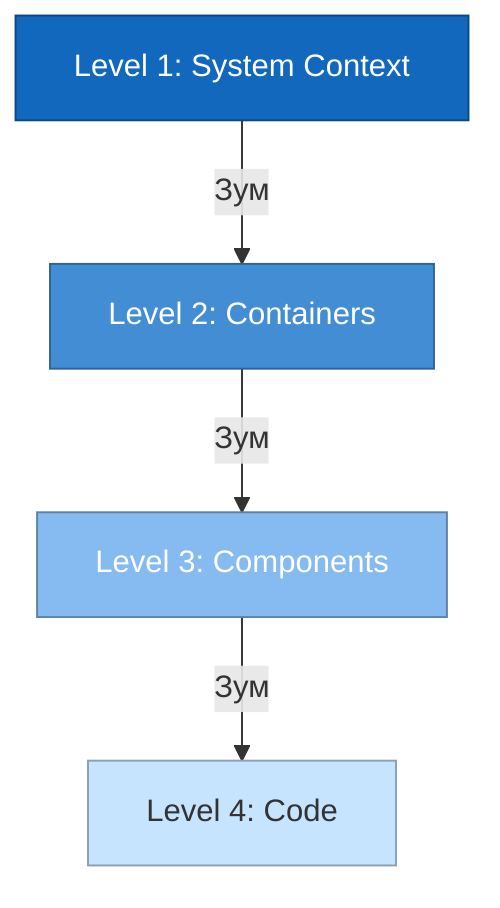

# C4 Model во Frontend-разработке

**C4 Model (Context, Containers, Components, Code)** — это легковесный подход к документированию архитектуры программного обеспечения. Он предлагает описывать систему как набор иерархических диаграмм, подобно тому, как мы используем Google Maps: от вида на всю планету до конкретной улицы.

### Какую боль мы решаем?
Когда архитектора или сеньора просят нарисовать архитектуру, обычно получается либо "диаграмма из двух квадратиков", которая ничего не объясняет, либо "спагетти из сотен стрелочек", в которой невозможно разобраться. 

C4 решает проблему **уровня абстракции**. Разным людям нужна разная детализация:
- Бизнесу и продакт-менеджерам нужно понимать, с какими внешними системами мы интегрируемся (Context).
- DevOps и бэкендерам важно видеть, как фронтенд общается с API и где он хостится (Containers).
- Разработчикам фич нужно понимать внутреннее устройство приложения (Components).

### Как это работает на практике

C4 предлагает 4 уровня детализации (однако во фронтенде чаще всего используют только первые два-три).

1. **Context**: Ваша система (Frontend) как один чёрный ящик. Кто пользователи? Какие внешние API дёргаются (Payment Gateway, Auth Service)?
2. **Containers**: Приложение разбивается на независимо развёртываемые сущности. Для веба это: SPA (React), BFF (Node.js), Мобильное приложение (React Native).
3. **Components**: Заглядываем внутрь SPA. Из каких крупных логических блоков он состоит? (Например: Auth Module, Router, Store, API Client, UI-Kit). *Не путать с React-компонентами!*
4. **Code**: Уровень классов и функций (UML). **Почти никогда не используется**, так как код меняется слишком быстро.

### Примеры из жизни

**Антипаттерн**: На вопрос "Как устроена ваша система?" разработчик открывает IDE и начинает показывать папки: `src/components`, `src/utils`... Это уровень Code, который бесполезен для понимания общей картины.

**Правильное решение**: Архитектор открывает **Container Diagram**.
«Смотрите, у нас есть клиентское SPA-приложение (Контейнер 1). Оно хостится на AWS S3 + CloudFront. Оно ходит за данными не напрямую в микросервисы, а через наш Backend-For-Frontend на Node.js (Контейнер 2), который агрегирует данные и решает проблемы с CORS. Также SPA использует внешний сервис Stripe для платежей». Всё чётко и понятно.

### Неочевидные нюансы и трейдоффы

1. **Терминологическая путаница**: Самая большая боль C4 во фронтенде — это слово "Component". В C4 "компонент" — это крупный архитектурный строительный блок (например, слой работы с сетью или модуль корзины). Но фронтендеры привыкли называть "компонентами" кнопочки и инпуты. Это нужно сразу проговаривать на берегу.
2. **Оверхед на поддержку**: Диаграммы устаревают быстрее, чем вы их рисуете. Поэтому золотое правило C4: **Остановитесь на том уровне детализации, который ещё имеет смысл поддерживать**. Для большинства фронтенд-команд достаточно уровней 1 (Context) и 2 (Containers). Уровень 3 рисуют только для очень сложного ядра приложения, а уровень 4 игнорируют.
3. **Docs-as-Code**: Чтобы диаграммы не протухали, их лучше описывать кодом (PlantUML, Mermaid, Structurizr) и хранить в репозитории рядом с исходным кодом.
