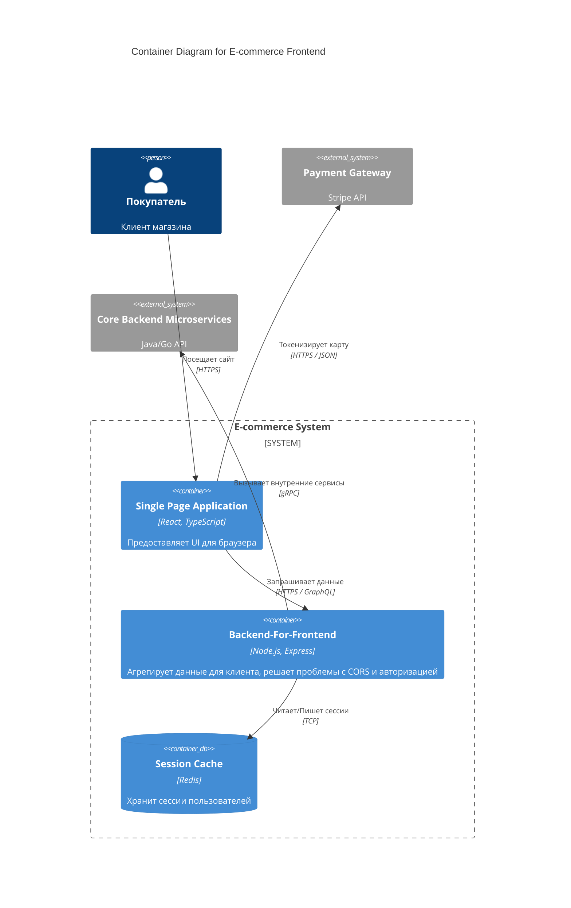

# Container Diagram (C4 Level 2)

**Container Diagram (Диаграмма контейнеров)** — это второй уровень детализации в модели C4. Он отвечает на вопрос: "Из каких независимо развёртываемых единиц (контейнеров) состоит наша система и как они общаются друг с другом?".

> [!WARNING] Важно
> В контексте C4 слово "Контейнер" **не означает Docker**. Контейнер — это любой исполняемый модуль, который можно задеплоить: Single Page Application (SPA), мобильное приложение, база данных, микросервис, серверный рендеринг (Node.js).

### Какую боль мы решаем?
Когда новый фронтенд-разработчик приходит на проект, ему нужно понять, как его код попадёт к пользователю и с кем он будет общаться. Если мы дадим ему только высокоуровневую Context Diagram, он не поймёт, где живет фронт. Если дадим диаграмму классов — он утонет в деталях. 

Диаграмма контейнеров даёт идеальный баланс: она показывает, что у нас есть Web App, которое раздаётся с CDN, общается с BFF (Backend-For-Frontend) по GraphQL, а мобилка ходит напрямую в API Gateway по REST.

### Как это работает на практике

На этой диаграмме отображаются:
1. Пользователи (Actors).
2. Ваши контейнеры (SPA, SSR, BFF, Mobile App).
3. Внешние системы (к которым вы обращаетесь).
4. **Стрелки взаимодействий** с обязательным указанием протокола (HTTPS, WSS) и формата данных (JSON, GraphQL).

### Примеры использования

**Антипаттерн**: Рисовать на диаграмме контейнеров внутренние модули React-приложения (Redux store, компоненты кнопок). Это смешивание уровней абстракции.

**Правильное решение**: Показать на диаграмме, что у нас есть клиентское приложение, которое использует Service Worker для кэширования статики, и общается с сервером по WebSockets для получения уведомлений.

### Неочевидные нюансы: скрытые трейдоффы

1. **Множество фронтендов**: В современной веб-разработке "фронтенд" редко бывает одним контейнером. У вас может быть клиентское SPA, SSR-сервер (Next.js), микрофронтенды, загружаемые с разных доменов, и BFF. Диаграмма контейнеров отлично подсвечивает эту распределённую сложность.
2. **Перегруженность**: Если ваша система состоит из 50 микросервисов, попытка нарисовать их все на одной диаграмме контейнеров превратит её в "звезду смерти" (Death Star architecture). В таких случаях бэкенд обычно сворачивают в один ящик "API Gateway", а фокус делают именно на клиентских контейнерах.
3. **Границы применимости**: Эта диаграмма обязательна для любого проекта сложнее лендинга. Без неё DevOps не сможет правильно настроить CI/CD пайплайны и проброс портов/доменов.
