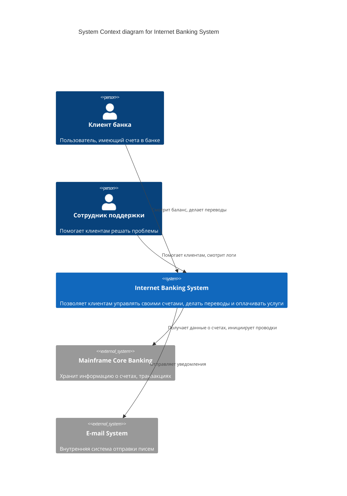

# Context Diagram (C4 Level 1)

**Context Diagram (Диаграмма контекста)** — это первый, самый высокий уровень абстракции в модели C4. Она показывает вашу программную систему как единый "черный ящик", окруженный пользователями и внешними системами. 

### Какую боль мы решаем?
Часто разработчики слишком быстро закапываются в технические детали (какой стейт-менеджер выбрать, как настроить вебпак), теряя из виду бизнес-смысл приложения. 

Диаграмма контекста отвечает на фундаментальные вопросы:
- **Кто** пользуется нашей системой?
- **Какую ценность** мы им предоставляем?
- От каких **внешних систем** мы зависим (и если они упадут, мы тоже упадем)?

Эта диаграмма создается в первую очередь для бизнеса, менеджеров проектов и нетехнических стейкхолдеров. На ней **нет технологий** (слов React, Node.js, SQL здесь быть не должно).

### Как это работает на практике

На диаграмме всегда есть три типа элементов:
1. **Ваша система** (System) — в самом центре.
2. **Пользователи / Роли** (Actors / Persons).
3. **Внешние системы** (External Systems) — сервисы, которые вы не разрабатываете, но используете (SaaS, легаси-системы, сторонние API).

### Примеры: Антипаттерн vs Правильное решение

**Антипаттерн**: Писать на стрелочках технические протоколы: `HTTPS`, `gRPC`, `Kafka`.
*Почему:* Эта диаграмма должна быть понятна CEO компании. Ему неважно, как именно идет сигнал, ему важно бизнес-действие ("Отправляет уведомление").

**Правильное решение**: Описывать бизнес-взаимодействие. `Покупатель -> Ищет товары -> Система`. `Система -> Запрашивает статус оплаты -> Stripe API`.

### Неочевидные нюансы: скрытые трейдоффы

1. **Проблема границ (System Boundaries)**: Самое сложное — понять, где заканчивается ваша система и начинается внешняя. Если команда фронтенда и команда бэкенда работают вместе над одним продуктом, для внешнего мира они — одна System. 
2. **Выявление "теневых" зависимостей**: В процессе рисования часто всплывают неудобные факты. Например, выясняется, что для входа в систему нужен SMS-шлюз, о котором все забыли, а он стоит денег и имеет квоты. Диаграмма контекста делает эти риски видимыми.
3. **Оверхед**: Эта диаграмма самая дешевая в производстве. Она занимает 10 минут времени, но экономит недели потенциальных споров о границах ответственности проекта. Ее нужно рисовать *всегда* перед началом разработки.
